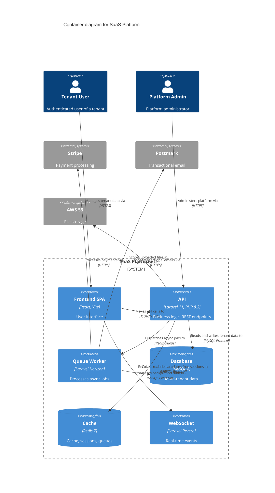

# C4 Diagram

Mermaid architecture diagrams using Simon Brown's C4 model. Output to `docs/architecture/`.

**Activate** after `tech-spec` (sec. 4 Component Breakdown), or on system overview requests.

---

## C4 Levels

| Level | Diagram | Mermaid | Audience |
|-------|----------|---------|-----------|
| 1 | **Context** | `C4Context` | Everyone — system + actors + external systems |
| 2 | **Container** | `C4Container` | Technical team — apps, services, DBs |
| 3 | **Component** | `C4Component` | Devs — internal structure of a container |
| 4 | **Code** | `classDiagram` | Devs — classes/functions (rare, on demand) |

**Golden rule:** Context + Container suffice for most teams. Generate level 3/4 only if requested or the container is complex.

---

## Mode Detection

Identify mode before producing any diagram:

| Signal | Mode |
|-------|------|
| Vague idea, no code, "I want to draw..." | **Design** (greenfield) |
| Path to a repo, existing code | **Document-code** (retro-document) |
| README, spec, PRD shared | **Document-prose** (retro from docs) |
| Existing diagram + "is this right?" | **Review** |
| Existing diagram + "add X" | **Update** |

If unclear, ask: "Do you want to (a) design a new architecture, (b) document an existing system, or (c) review/update a diagram?"

---

## Output

### Directory

```
docs/
└── architecture/
    ├── 01-context.md
    ├── 02-container.md
    └── 03-component-[name].md    ← only if requested
```

### Template per Level

```markdown
# [Level] — [System Name]

## Overview
[1-2 sentences: what this diagram shows]

## Diagram

\```mermaid
C4Container
    title Container diagram for [System]
    ...
\```

## Elements

| Name | Type | Technology | Responsibility |
|------|------|-----------|-----------------|
| [name] | Container/DB/Queue | [tech] | [what it does] |

## Key relations

| From | To | Intent | Protocol |
|----|------|--------|-----------|
| [source] | [target] | [what it does] | [HTTP/gRPC/AMQP/...] |

## Architectural decisions
- [decision relevant to this level]

## Assumptions
- [unconfirmed inferences — NEVER incorporate silently]
```

---

## Notation Rules (non-negotiable)

### Diagram
- Explicit title always
- Legend in the Markdown doc
- Acronyms explained

### Elements
- Explicit type (Person, System, Container, Component, DB, Queue)
- Short responsibility description
- **Technology mandatory** on Container and Component (e.g. "Java, Spring Boot", "PostgreSQL 15")

### Relations
- **Unidirectional** arrows (avoid BiRel -- split into two Rel)
- Labels with **concrete intent** -- FORBIDDEN: "Uses", "Calls", "Reads". CORRECT: "Reads account balances from", "Publishes OrderCreated events to"
- Inter-container relations must state **protocol** (HTTPS/JSON, gRPC, AMQP, JDBC, SMTP)

---

## Mermaid C4 Cheatsheet

### Elements

```
Person(alias, "Label", "Description")
Person_Ext(alias, "Label", "Description")
System(alias, "Label", "Description")
System_Ext(alias, "Label", "Description")
SystemDb(alias, "Label", "Description")

Container(alias, "Label", "Technology", "Description")
ContainerDb(alias, "Label", "Technology", "Description")
ContainerQueue(alias, "Label", "Technology", "Description")

Component(alias, "Label", "Technology", "Description")
```

### Boundaries

```
Enterprise_Boundary(alias, "Enterprise") { ... }
System_Boundary(alias, "System") { ... }
Container_Boundary(alias, "Container") { ... }
```

### Relations

```
Rel(from, to, "Intent label", "Protocol")
Rel_D(from, to, "Label")    # down
Rel_R(from, to, "Label")    # right
```

### Example -- Laravel Container Diagram



---

## Process

### Design (greenfield)

1. Gather context: read PRD + TECH_SPEC if they exist
2. Questions (max 5 per batch):
   - Who are the actors? (users, admins, external systems)
   - Which external systems does it integrate?
   - Monolith or separate services?
3. Produce Context diagram (level 1)
4. Present, iterate
5. Produce Container diagram (level 2)
6. Present, iterate
7. Write files only after explicit approval

### Document-code (retro)

1. Explore codebase: `composer.json`/`package.json`, routes, config, `.env.example`
2. Identify containers (apps, DBs, caches, queues, external services)
3. Generate diagrams from real code
4. Mark assumptions (unconfirmed inferences)
5. Present for validation

### Review

1. Read existing diagram
2. Check against checklist (notation, labels, technologies)
3. Report issues: missing technologies, vague labels, mixed levels
4. Suggest fixes

### Update

1. Read existing diagram
2. Apply requested change
3. Verify cross-level consistency
4. Present diff

---

## Common Mistakes

| Mistake | Problem | Fix |
|------|----------|-----|
| Mixing levels | Container next to Component in the same diagram | One level per diagram |
| Forgetting external systems | The system looks isolated | Context level shows EVERYTHING that interacts |
| Vague labels ("Uses", "Calls") | Communicates nothing | Concrete intent + protocol |
| No technology on containers | You cannot tell what it is | Always: "Laravel 11, PHP 8.3" |
| Diagram with no document | A diagram is ambiguous on its own | Always accompany it with Markdown |
| Delivering without validating | Unconfirmed assumptions | Never write files without the user's "ok" |

---

## Workflow

Pipeline position in the JOCA sequence:

-> **before**: `tech-spec` (sec. 4 Component Breakdown as input)
-> **lateral**: `adr` (architectural decisions logged during diagramming)
-> **after**: `task-breakdown` (break components into atomic work)

Notify on completion: `-> next: task-breakdown`
