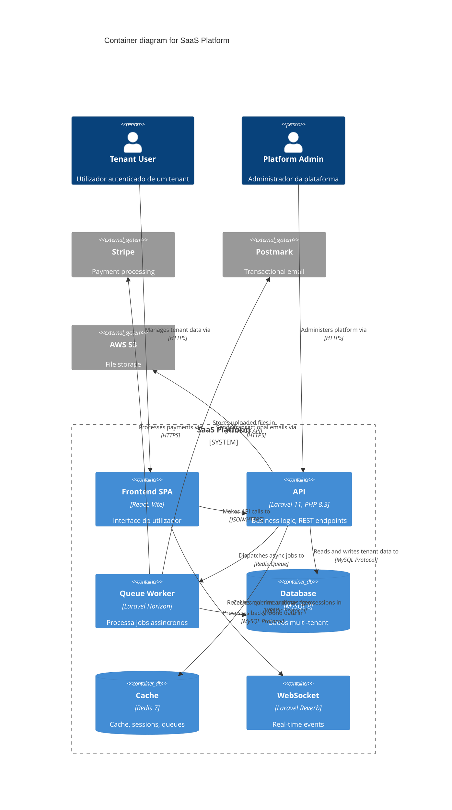

# C4 Diagram

Diagramas de arquitectura em Mermaid usando o modelo C4 de Simon Brown. Output em `docs/architecture/`.

**Activar** apos `tech-spec` (sec. 4 Component Breakdown), ou quando alguem pede visao geral do sistema.

---

## Niveis C4

| Nivel | Diagrama | Mermaid | Audiencia |
|-------|----------|---------|-----------|
| 1 | **Context** | `C4Context` | Todos — sistema + actores + sistemas externos |
| 2 | **Container** | `C4Container` | Equipa tecnica — apps, servicos, DBs |
| 3 | **Component** | `C4Component` | Devs — estrutura interna de um container |
| 4 | **Code** | `classDiagram` | Devs — classes/funcoes (raro, on demand) |

**Regra de ouro (Simon Brown):** Context + Container sao suficientes para a maioria das equipas. So gerar nivel 3/4 se pedido explicitamente ou se o container e complexo.

---

## Mode detection

Antes de produzir qualquer diagrama, identificar o modo:

| Sinal | Modo |
|-------|------|
| Ideia vaga, sem codigo, "quero desenhar..." | **Design** (greenfield) |
| Path para repo, codigo existente | **Document-code** (retro-documentar) |
| README, spec, PRD partilhado | **Document-prose** (retro de docs) |
| Diagrama existente + "esta bem?" | **Review** |
| Diagrama existente + "adiciona X" | **Update** |

Se nao for claro, perguntar: "Queres (a) desenhar arquitectura nova, (b) documentar sistema existente, ou (c) rever/actualizar diagrama?"

---

## Output

### Directorio

```
docs/
└── architecture/
    ├── 01-context.md
    ├── 02-container.md
    └── 03-component-[nome].md    ← so se pedido
```

### Template por nivel

```markdown
# [Nivel] — [Nome do Sistema]

## Overview
[1-2 frases: o que este diagrama mostra]

## Diagrama

\```mermaid
C4Container
    title Container diagram for [Sistema]
    ...
\```

## Elementos

| Nome | Tipo | Tecnologia | Responsabilidade |
|------|------|-----------|-----------------|
| [nome] | Container/DB/Queue | [tech] | [o que faz] |

## Relacoes chave

| De | Para | Intent | Protocolo |
|----|------|--------|-----------|
| [origem] | [destino] | [o que faz] | [HTTP/gRPC/AMQP/...] |

## Decisoes arquitecturais
- [decisao relevante para este nivel]

## Assumptions
- [inferencias nao confirmadas — NUNCA incorporar silenciosamente]
```

---

## Regras de notacao (non-negotiable)

### Diagrama
- Titulo explicito sempre
- Legenda no documento Markdown
- Acronimos explicados

### Elementos
- Tipo explicito (Person, System, Container, Component, DB, Queue)
- Descricao curta da responsabilidade
- **Tecnologia obrigatoria** em Container e Component (ex: "Java, Spring Boot", "PostgreSQL 15")

### Relacoes
- Setas **unidireccionais** (evitar BiRel — dividir em dois Rel)
- Labels com **intent concreto** — PROIBIDO: "Uses", "Calls", "Reads". CORRECTO: "Reads account balances from", "Publishes OrderCreated events to"
- Relacoes inter-container devem indicar **protocolo** (HTTPS/JSON, gRPC, AMQP, JDBC, SMTP)

---

## Mermaid C4 — cheatsheet

### Elementos

```
Person(alias, "Label", "Description")
Person_Ext(alias, "Label", "Description")
System(alias, "Label", "Description")
System_Ext(alias, "Label", "Description")
SystemDb(alias, "Label", "Description")

Container(alias, "Label", "Technology", "Description")
ContainerDb(alias, "Label", "Technology", "Description")
ContainerQueue(alias, "Label", "Technology", "Description")

Component(alias, "Label", "Technology", "Description")
```

### Boundaries

```
Enterprise_Boundary(alias, "Enterprise") { ... }
System_Boundary(alias, "System") { ... }
Container_Boundary(alias, "Container") { ... }
```

### Relacoes

```
Rel(from, to, "Intent label", "Protocol")
Rel_D(from, to, "Label")    # down
Rel_R(from, to, "Label")    # right
```

### Exemplo — Container diagram Laravel



---

## Processo

### Design (greenfield)

1. Recolher contexto: ler PRD + TECH_SPEC se existirem
2. Perguntas (max 5 por batch):
   - Quem sao os actores? (utilizadores, admins, sistemas externos)
   - Que sistemas externos integra?
   - Monolito ou servicos separados?
3. Produzir Context diagram (nivel 1)
4. Apresentar, iterar
5. Produzir Container diagram (nivel 2)
6. Apresentar, iterar
7. So escrever ficheiros apos aprovacao explicita

### Document-code (retro)

1. Explorar codebase: `composer.json`/`package.json`, routes, config, `.env.example`
2. Identificar containers (apps, DBs, caches, queues, servicos externos)
3. Gerar diagramas a partir do codigo real
4. Marcar assumptions (inferencias nao confirmadas)
5. Apresentar para validacao

### Review

1. Ler diagrama existente
2. Verificar contra checklist (notacao, labels, tecnologias)
3. Reportar issues: missing technologies, vague labels, mixed levels
4. Sugerir correccoes

### Update

1. Ler diagrama existente
2. Aplicar mudanca pedida
3. Verificar consistencia entre niveis
4. Apresentar diff

---

## Erros comuns

| Erro | Problema | Fix |
|------|----------|-----|
| Misturar niveis | Container ao lado de Component no mesmo diagrama | Um nivel por diagrama |
| Esquecer sistemas externos | Sistema parece isolado | Context level mostra TUDO que interage |
| Labels vagas ("Uses", "Calls") | Nao comunica nada | Intent concreto + protocolo |
| Sem tecnologia em containers | Nao se sabe o que e | Sempre: "Laravel 11, PHP 8.3" |
| Diagrama sem documento | Diagrama e ambiguo sozinho | Sempre acompanhar com Markdown |
| Entregar sem validar | Assumptions nao confirmadas | Nunca escrever ficheiros sem "ok" do utilizador |

---

## Workflow

Pipeline desta skill na sequencia JOCA:

→ **antes**: `tech-spec` (sec. 4 Component Breakdown como input)
→ **lateral**: `adr` (decisoes arquitecturais registadas durante o diagrama)
→ **apos**: `task-breakdown` (quebrar componentes em trabalho atomico)

Notificar ao concluir: `→ proximo: task-breakdown`
