# TECH_SPEC — JOCA_OS v2 (Master)

**Versão:** 2.0 (draft)
**Estado:** Spec técnica
**Última actualização:** 2026-06-21
**Autor:** [Nome do Utilizador]
**Alinha com:** `FUTUROS.md` Fase 1 (Master), `CLAUDE.md`, `memory/soul.md`

---

## 0. Sumário

JOCA_OS v2 ("Master") é uma **camada aditiva** sobre a base JOCA_UI já
existente. Não se reescreve nada.

Estado actual verificado (não fabricado):

- Backend Node/Express/`ws`/`node-pty` em `backend/src/server.ts` (1703 linhas).
- Frontend React 18 + Vite 5 + xterm.js; deps de chat já presentes
  (`marked`, `highlight.js`).
- Package names ainda `joca-ui-backend` / `joca-ui-frontend`.
- Portas: `start.bat` usa `7371` (backend) / `7372` (frontend); `vite.config.ts`
  faz proxy `/ws` → `7371`. O `server.ts` cai para `3001` só quando `PORT` não
  está definido (`process.env.PORT || 3001`, L926/L1694) — em uso normal o
  `start.bat` injecta `PORT=7371`.
- **Nenhum SDK de provider instalado** (deps backend = `express`, `ws`,
  `node-pty`).
- `server.ts` faz `pty.spawn(SHELL, ...)` (L581) e escreve o binário
  `${CLAUDE_BIN}` no PTY (L~622, `ptyProcess.write(\`${CLAUDE_BIN}...\r\`)`).
  Hoje toda a "orquestração" é o humano a escrever no terminal.

O Master inverte isto: um chat **não-terminal** onde o utilizador fala em
linguagem natural, e um cérebro **provider-agnóstico** (default Claude Agent
SDK na subscrição; alternativas Gemini / Codex / Ollama) que, via tool-calls,
**abre / instrui / lê / fecha** terminais Claude Code (workers), reutilizando o
session manager existente. O humano nunca toca nos terminais.

Premissa económica (lição v1 validada): os workers correm na **subscrição
Anthropic** (Pro/Max), sem `ANTHROPIC_API_KEY` → custo zero. O cérebro do Master
usa modelo barato/local e cai para **Ollama** quando a quota cloud esgota.

> **AVISO crítico (confirmado, não fabricado).** Se `ANTHROPIC_API_KEY` existir
> no env, vence silenciosamente o token de subscrição e factura créditos. O
> Master TEM de limpar `ANTHROPIC_API_KEY`/`ANTHROPIC_AUTH_TOKEN` do env passado
> ao SDK/worker antes de invocar.

> **TODO (anti-fabricação).** "Gemini na subscrição Google" **não** tem path SDK
> verificado: `@google/genai` usa API key. Gemini fica desactivado por defeito
> até o path de subscrição ser confirmado.

> **TODO de verificação.** Os nomes/assinaturas exactos da API do Agent SDK
> (`query`, streaming input, `createSdkMcpServer`, `tool`, tipos
> `SDK*Message`, campo `usage`, evento de compactação) **não foram verificados
> em runtime nesta spec** — a doc oficial está atrás de uma cadeia de redirects
> entre hosts que não resolveu via fetch. O **nome e existência do pacote**
> `@anthropic-ai/claude-agent-sdk` (v0.3.185) está confirmado no npm. Confirmar
> as assinaturas contra a doc oficial **ao implementar** (`docs.claude.com` →
> Agent SDK / TypeScript). Onde abaixo se nomeiam identificadores do SDK, são
> **candidatos a confirmar**, não factos assentes.

---

## 1. Arquitectura

Camada Master **por cima** da base UI. De baixo para cima: infra reutilizada →
camada Master nova → camada UI nova.

```mermaid
flowchart TB
    subgraph UI["CAMADA UI (nova MainView, reusa shell)"]
        chat["Master Chat (marked + highlight.js)"]
        cards["Workers view (cards de estado + 'abrir terminal')"]
        term["SessionView xterm (existente)"]
        nav["NavRail / RightWorkspace / CmdK / Toast (existentes)"]
    end

    subgraph MASTER["CAMADA MASTER (módulos novos no backend)"]
        orch["Orchestrator (control loop NL→tool-call)"]
        pm["ProviderManager (interface MasterProvider)"]
        wr["WorkerRegistry (estado + agregação de resumos)"]
        mt["MasterTools (spawn/send/read/list/interrupt)"]
        mem["MemoryManager (3 camadas)"]
        wb["WorkerBrief builder (regras não-herdadas)"]
    end

    subgraph INFRA["INFRA REUTILIZADA (extrair de server.ts, NÃO reescrever)"]
        sm["SessionManager (spawn/input/buffer/kill/resize/idle)"]
        ws["WS transport (/ws broadcast/reconnect)"]
        ps["ProjectStore + ProjectMemory"]
        rl["RateLimits (Claude/Codex/AGY)"]
        cc["CliCapabilities (getCliTools)"]
        tk["ToolkitRegistry (skills/agents/commands do Brain)"]
        sec["Security FS (allowlist/safePath/loopback)"]
    end

    subgraph PROV["PROVIDERS (cérebro do Master)"]
        claude["Claude Agent SDK (subscrição) — DEFAULT"]
        codex["Codex SDK (subscrição ChatGPT)"]
        gemini["Gemini @google/genai (API key — TODO subscrição)"]
        ollama["Ollama local (FALLBACK, 127.0.0.1:11434)"]
    end

    subgraph WORKERS["WORKERS (Claude Code na subscrição Anthropic, custo zero)"]
        w1["worker PTY #1"]
        w2["worker PTY #2"]
        wN["worker PTY #N (cap 3-5)"]
    end

    chat --> orch
    cards --> wr
    orch --> pm
    pm --> claude & codex & gemini & ollama
    orch --> mt
    mt --> sm
    sm --> w1 & w2 & wN
    sm --> wr
    wr --> orch
    orch --> mem
    wb --> mt
    orch --> ps & rl & cc & tk
    mt --> sec
    sm --> ws --> chat
    cards --> term
```



### 1.1 Camadas

**1) Infra reutilizada** (existe; extrair para módulos, não reescrever):

| Bloco | Origem | Papel no Master |
|---|---|---|
| SessionManager | `server.ts` L569-687 (`pty.spawn`, `input`, `buffer`, `kill`, `resize`, idle) | Executor de workers |
| WS transport | `/ws`, broadcast, reconnect | Canal UI↔backend; +tipos de mensagem |
| ProjectStore + ProjectMemory | `readJsonFile`/`writeJsonFile` L115-129 | Contexto p/ decidir delegação |
| RateLimits | `readClaudeToken` L957, `getClaudeOAuthUsage` L992, `getCodexLimits` L1013 | Sinal de quota → fallback |
| CliCapabilities | `getCliTools` L442 | Descoberta de providers no arranque |
| ToolkitRegistry | `collectToolkitItems` L339, `/joca-items`, `/knowledge-graph` | Rotear tarefas a skills/agents |
| Security FS | `isSensitivePath` L233, `safePath` L256, `requireSafeOrigin` L273, `listen` em `127.0.0.1` L1695 | Reuso tal-e-qual em Acções (Fase 4) |

**2) Camada Master** (módulos novos no backend):

- **ProviderManager** — implementa `MasterProvider` (§3). Mantém a sessão de
  chat viva do cérebro, faz streaming de tokens, emite tool-calls, recebe
  tool-results. Troca de provider em runtime; `available()` alimenta o fallback.
- **Orchestrator** (control plane) — recebe a mensagem NL → pede ao
  ProviderManager → este emite tool-calls → executa-as contra o SessionManager →
  devolve `ToolResult` → provider continua → resume ao utilizador. Cap de
  concorrência 3-5 workers (CLAUDE.md). Verifica quota antes de cada spawn.
- **WorkerRegistry** — `{id, projectId, status, brief, lastSummary}`. Subscreve
  `session_status`; numa transição idle-após-trabalho-real, lê o buffer (strip
  ANSI), pede ao provider barato um resumo 2-3 linhas, guarda, e apresenta só o
  agregado ao humano.
- **MasterTools** — ferramentas expostas ao provider. Wiring difere por provider
  (§3) mas a superfície é a mesma.
- **MemoryManager** — 3 camadas próprias do Master (§5).
- **WorkerBrief builder** — monta o brief de cada worker carregando
  **explicitamente** as regras que sub-agentes não herdam (§6.2).

**3) Camada UI** (nova MainView; reusa shell):

- Nova MainView `'master'` no switch de `App.tsx` (ao lado de
  `dashboard`/`project`/`session`), reutilizando NavRail/RightWorkspace/Toast/CmdK
  e a paleta do `DESIGN.md`.
- Painel de chat (com `marked` + `highlight.js`, já em deps) distinto dos painéis
  xterm.
- Vista de N workers em paralelo. Recomendação: **cards de estado** com resumo
  inline + botão "abrir terminal" que salta para a `SessionView` xterm existente
  (não reinventar o terminal).
- Cmd+K palette extensível com comandos do Master.

### 1.2 Fluxo comando / leitura / done (verificado contra código)

- **Comando a worker**: Orchestrator → `SessionManager.input(sessionId, texto)`
  → `pty.write(texto + '\r')` (path `input` já existente, L~588/626).
- **Leitura**: `SessionManager` expõe `session.buffer` (ring buffer em RAM,
  `BUFFER_MAX = 5_000_000`, L142/L645) + evento `session_status`. O Master lê o
  buffer no idle-após-trabalho.
- **Done (estado actual, frágil)**: heurística por silêncio —
  `IDLE_DEBOUNCE_MS = 1500` (L143), `DONE_MIN_WORK_MS = 2000` (L144); um worker
  à espera de input parece "done" (L669-677).
- **Done (melhoria recomendada)**: instruir o worker a imprimir um **marcador
  sentinela** único no fim (ex.: `<<<JOCA_DONE:taskId>>>`) e o Master detectar
  ESSE no buffer, mantendo o silêncio só como heurística de **status**, não de
  conclusão.
  - **Desambiguação (obrigatória)**: o próprio brief CONTÉM a string literal do
    sentinela, logo a 1.ª leitura do buffer daria um falso-positivo "done". Para
    evitar: (a) o `taskId` é um **nonce único por tarefa** (ex.:
    `<<<JOCA_DONE:7f3a9c2e>>>`) e o matcher procura o nonce DESTA tarefa, não o
    padrão genérico; **e/ou** (b) o sentinela só conta quando está **sozinho na
    sua própria linha** (matching anchored à linha inteira após strip-ANSI/trim:
    `^<<<JOCA_DONE:<nonce>>>>$`), nunca inline no meio de texto. Documentar a
    regra de matching junto ao detector.
  Alternativa para tarefas autónomas críticas: worker headless via
  segundo `query()` do Agent SDK (done determinístico via mensagem de resultado)
  — trabalho posterior, fora do MVP.

---

## 2. Stack

| Camada | Tecnologia | Estado |
|---|---|---|
| Backend runtime | Node.js + TypeScript (`tsx` dev, `tsc` build) | existe |
| HTTP/WS | Express 4 + `ws` 8 | existe |
| Terminais | `node-pty` 1.x | existe |
| Frontend | React 18 + Vite 5 | existe |
| Terminal UI | `@xterm/xterm` 5 + addons fit/web-links | existe |
| Markdown chat | `marked` 18 + `highlight.js` 11 | existe (reuso p/ chat) |
| Cérebro default | `@anthropic-ai/claude-agent-sdk` (npm: v0.3.185, **nome confirmado**) | **adicionar (Fase MVP)** |
| Cérebro alt | `@openai/codex-sdk` (v0.141.0), `@google/genai` (v2.9.0), `ollama` (v0.6.3) | **adicionar (Fase 1b)** |
| Persistência | ficheiros JSON (`readJsonFile`/`writeJsonFile`) + ficheiros de memória (§5) | padrão existente |

Sem base de dados nova. Local-first, loopback (`127.0.0.1`), 1 JOCA por pessoa.

> Versões de SDK confirmadas a existir no npm em 2026-06-21 (`npm view`).
> Fixar a versão concreta no `package.json` ao instalar.

> **Constraint de runtime — Node >= 22.5 (dura).** `getCodexLimits`
> (`server.ts` ~L1011-1020) usa `node:sqlite`, módulo ausente em Node 20 /
> < 22.5. Outros projectos do utilizador fazem gate em **Node >= 20.17**, logo uma
> instalação fresca pode cair abaixo deste mínimo e **partir silenciosamente** a
> leitura de rate-limits do Codex (o sinal de quota que alimenta o fallback).
> Gate explícito de versão no arranque.

---

## 3. Camada provider-agnóstica

Interface única contra a qual o Master programa. O **cérebro** = modelo
barato/local; os **workers** continuam Claude Code na subscrição.

```ts
interface MasterProvider {
  id: 'claude' | 'gemini' | 'codex' | 'ollama';
  // streaming de tokens + tool-calls
  send(messages, tools, signal): AsyncIterable<ProviderEvent>;
  // ProviderEvent = {textDelta} | {toolCall:{name,args,id}} | {done, usage?}
  submitToolResults(results): void;
  available(): Promise<{ ok: boolean; reason?: string }>; // probe auth/health
}
```

Duas famílias estruturais, ambas absorvidas pela interface (todas expõem
streaming + function-calling):

- **A) SDK-conduz-CLI-logado (custo zero via subscrição):** Claude Agent SDK,
  Codex SDK.
- **B) cliente-API-directo:** Gemini `@google/genai`, Ollama.

### 3.1 Claude — DEFAULT

- Pacote: `@anthropic-ai/claude-agent-sdk` (**confirmado no npm**).
- Chat longo: streaming input mode (prompt como `AsyncIterable` de mensagens
  user; follow-ups via stream). Ferramentas do Master = **in-process MCP**
  (`createSdkMcpServer` + `tool`), ligadas via options.
- Auth subscrição: o SDK conduz o CLI `claude` logado → quota Pro/Max, custo
  zero. Token: `claude setup-token` → `CLAUDE_CODE_OAUTH_TOKEN`.
- **Precedência de auth** (hipótese de trabalho a confirmar na implementação —
  a doc oficial `code.claude.com/docs/en/settings` confirma os métodos de auth
  mas **não publica uma ordem de precedência explícita**):
  cloud creds > `ANTHROPIC_AUTH_TOKEN` > `ANTHROPIC_API_KEY` > apiKeyHelper >
  `CLAUDE_CODE_OAUTH_TOKEN`. → Independentemente da ordem, a acção segura
  (requisito **DURO**) é: o Master **limpa** `ANTHROPIC_API_KEY` e
  `ANTHROPIC_AUTH_TOKEN` do env passado e corre um **probe-diagnóstico** de qual
  auth está a vencer.

> Identificadores `query` / streaming input / `createSdkMcpServer` / `tool` /
> tipos `SDK*Message` / `usage` = **candidatos a confirmar** contra a doc
> oficial ao implementar (ver TODO no §0). Não assumir do contexto.

### 3.2 Gemini

- Pacote: `@google/genai` (**confirmado**; novo SDK unificado — o antigo
  `@google/generative-ai` está deprecated, **não usar**).
- Chat + function-calling via streaming.
- Auth: **API key** (`GEMINI_API_KEY`/`GOOGLE_API_KEY`).
- **TODO/desactivado por defeito**: "Gemini na subscrição Google" não tem path
  SDK verificado. Opções a avaliar: (a) API key free-tier; (b) spawn do CLI
  `gemini`/`agy` como sub-processo para reusar o login Google (mesma família do
  Codex CLI). Não assumir quota-de-subscrição via `@google/genai`.

### 3.3 Codex

- Pacote: `@openai/codex-sdk` (**confirmado**; envolve o CLI `@openai/codex`,
  JSONL por stdin/stdout). Multi-turn no mesmo Thread; resume p/ persistência.
- Auth subscrição: herda o login do CLI Codex (`codex login`, ChatGPT),
  estruturalmente igual ao Claude.

> Assinaturas exactas do Codex SDK = confirmar contra doc ao implementar.

### 3.4 Ollama — FALLBACK LOCAL

- Pacote: `ollama` (**confirmado**). Chat com `stream: true` + `tools` →
  `AsyncGenerator`.
- Auth: nenhuma; daemon local `127.0.0.1:11434`; custo zero.
- É o fallback quando a quota cloud esgota. Ao trocar a meio da conversa, semear
  a nova sessão com o resumo da memória curta (§5).

### 3.5 Wiring das ferramentas + fallback

- Wiring difere por provider: in-process MCP (Claude), `tools[]` (Gemini/Ollama),
  thread events (Codex) — **interface igual**.
- **Fallback**: o Orchestrator observa `available()` + sinais de rate-limit (o
  dashboard de rate-limits já lê Claude/Codex/AGY). Na exaustão cloud troca para
  Ollama, carregando o resumo curto como seed. Os workers Claude Code continuam
  na própria quota Anthropic, independentes do cérebro.

---

## 4. Modelo de orquestração

Control loop do Orchestrator (NL → tool-call → executa → resume):

```
utilizador (NL)
   │
   ▼
Orchestrator ──► ProviderManager.send(messages, MasterTools)
   ▲                    │  stream
   │                    ▼
   │            {textDelta} ──► UI (master_message)
   │            {toolCall}  ──► executa contra SessionManager
   │                                │
   │                                ├─ spawn_worker(projectId, brief)
   │                                ├─ send_to_worker(id, texto)
   │                                ├─ read_worker(id)          (strip ANSI do buffer)
   │                                ├─ list_workers()
   │                                └─ interrupt_worker(id)
   │                                │
   │            ToolResult ◄────────┘
   │                    │
   └────────────────────┘  (provider continua)
   │
   ▼
resume agregado ao utilizador
```

### 4.1 MasterTools (superfície mínima do MVP)

| Tool | Acção sobre infra | Notas |
|---|---|---|
| `spawn_worker(projectId, brief)` | `SessionManager.spawn` | Verifica quota + cap 3-5 antes; injecta brief + sentinela |
| `send_to_worker(id, texto)` | `SessionManager.input` | `pty.write(texto + '\r')` |
| `read_worker(id)` | lê `session.buffer` | strip ANSI; devolve último excerto relevante |
| `list_workers()` | `WorkerRegistry` | `{id, status, lastSummary}` |
| `interrupt_worker(id)` | `SessionManager` (input Ctrl-C / kill) | irreversível-leve → status, não confirma |

### 4.2 Ciclo de vida de um worker (spawn / comando / leitura / idle-done / agregação)

1. **Spawn** — Orchestrator verifica quota (RateLimits) e cap de concorrência;
   WorkerBrief builder monta o brief (§6.2) com o sentinela `<<<JOCA_DONE:taskId>>>`;
   `SessionManager.spawn` abre o PTY e (já em código) escreve `${CLAUDE_BIN}` →
   o worker arranca na subscrição. WorkerRegistry regista `status: working`.
2. **Comando** — `send_to_worker` envia o brief/instruções no PTY.
3. **Leitura** — o Master **não** lê em streaming contínuo; lê o buffer no
   evento de idle-após-trabalho (evita ruído ANSI e gasto de tokens do cérebro).
4. **Idle-done** — `session_status idle` + (a) sentinela presente no buffer →
   **done determinístico**; ou (b) só silêncio > debounce → **status idle**
   (pode estar à espera de input — não é done). Done real ⇒ WorkerRegistry pede
   ao provider barato um resumo 2-3 linhas e guarda em `lastSummary`.
5. **Agregação** — quando todos os workers da tarefa estão done, o Orchestrator
   compõe **um** resumo agregado a partir dos `lastSummary` e resume ao humano.
   Cap supervisor 3-5 workers (CLAUDE.md "Context & Agents").

### 4.3 Decisões justificadas

- **Reusar o PTY existente** (workers visíveis) em vez de SDK-headless no MVP:
  alinha com a UX "N terminais visíveis", o humano pode assistir/assumir, e
  reusa infra já auditada. SDK-headless fica para fan-out crítico de fundo
  (done determinístico) numa fase posterior.
- **Sentinela > silêncio** para done: o silêncio confunde "à espera de input"
  com "terminou"; o sentinela é determinístico e barato (uma linha no brief).
- **Ler no idle, não em streaming**: poupa tokens do cérebro e evita parsear ANSI
  a cada chunk.
- **Cap 3-5**: custo real de sub-agente ~15x tokens (CLAUDE.md).

---

## 5. Sistema de memória (3 camadas)

Memória **própria do Master**, separada da do JOCA_Brain. Alinha com `FUTUROS`
Fase 7. Reusa o padrão `readJsonFile`/`writeJsonFile` e o padrão de índice lazy
do `SKILL_INDEX.json` do Brain.

### 5.1 Layout de ficheiros

```
master-memory/
├── curta.md                 # resumo de continuação SÓ da janela anterior (regenerado)
├── longa/
│   ├── INDEX.json           # {ts, title, tags, token-count} por janela
│   └── <ts>.md              # 1 resumo detalhado por janela (camada de pesquisa)
└── diario/
    └── <ts>.log             # log verbatim completo por janela (append-only)

master-memory-whatsapp/      # Fase 2 — namespace separado (não misturar canais)
```

### 5.2 Definições

- **Diário** — log verbatim de cada janela de contexto, append-only, 1 `.log`
  por janela. Fonte de verdade; nunca sumarizado in-place.
- **Longa** — 1 resumo detalhado por janela (`longa/<ts>.md`), indexado. Camada
  de pesquisa do meio: descobrir QUAL janela tem a resposta sem carregar logs.
- **Curta** — resumo de continuação SÓ da janela imediatamente anterior
  (`curta.md`). **Nunca acumula** — descartada a cada arquivo e regenerada.
  Semeia a próxima janela.

### 5.3 Gatilho de arquivo

Por **% de uso de contexto**, não relógio (recomendação; `FUTUROS` deixa o
threshold em aberto).

- **Claude**: usar o boundary de **compactação automática** do CLI/SDK + o campo
  de `usage` real (na mensagem de resultado) como ponto natural de arquivo —
  arquivar antes/no momento da compactação. *(Nome exacto do evento e do campo a
  confirmar contra a doc — ver TODO §0.)*
- **Gemini/Ollama/Codex** (sem evento de compact): estimar tokens pelo tamanho
  das mensagens e arquivar a ~70-80% da janela do modelo (alinha com CLAUDE.md
  "comprimir a 70-80%, antes da degradação").
- **Belt-and-suspenders**: arquivar também ao fechar a sessão.

### 5.4 Passo de arquivo (atómico, no gatilho)

1. Flush da janela actual verbatim → `diario/<ts>.log`.
2. Gerar resumo detalhado DESTA janela (provider barato/local) → `longa/<ts>.md`,
   com decisões/resultados **no início** (U-curve: crítico no início + fim).
3. Regenerar `curta.md` = resumo de continuação SÓ desta janela; descartar a
   curta anterior.
4. Abrir nova janela semeada com `curta.md` (+ entradas de `longa` sob procura).

### 5.5 Pesquisa / recall (curta → longa → diário)

- Pergunta recente → já em contexto (curta + janela viva). Responder directo.
- Pergunta de dias/semanas → procurar nos resumos **longa**, responder a partir
  do resumo.
- Detalhe exacto → localizar a janela via **longa**, abrir o **diário** dessa
  janela para recall verbatim.

### 5.6 Indexação (recomendação)

Começar com **grep/full-text** sobre `longa/*.md` (pequenos, só resumos; barato;
zero deps; ripgrep/Grep já disponível Windows-first) + `longa/INDEX.json` leve
(`ts`, `title`, `tags`, `token-count`), à imagem do `SKILL_INDEX.json`.
Adicionar **embeddings só se** o recall por grep se mostrar insuficiente
(embeddings trazem dependência + staleness de índice). Encriptação do diário =
decisão em aberto (não encriptado no MVP; local-first; reavaliar se a Fase 2
WhatsApp trouxer dados de terceiros).

### 5.7 Isolamento

Esta memória é só a continuidade da conversa do orquestrador. O Master **pode
ler** a memória do JOCA_Brain (`soul.md`, `projects/`, `INDEX.md`) como contexto
de sistema, mas **escreve as suas janelas só em** `master-memory/`. WhatsApp
(Fase 2) é um thread separado → namespace próprio (`master-memory-whatsapp/`).

---

## 6. Integração com JOCA_Brain

JOCA_Brain é o motor (skills/agents/commands/memory). O Master e os workers
consomem-no.

### 6.1 Consumo de skills / agents / commands

- O Master lê o `ToolkitRegistry` (`collectToolkitItems`, `/joca-items`) para
  saber que skills/agents/commands existem e **rotear** a tarefa certa ao worker.
- O Master **não** carrega o graph inteiro para decidir delegação. Carrega só o
  **estado-índice** (lista + estado de projectos via ProjectStore) e deixa o
  **worker** carregar o contexto pesado via `/resume` (que já lê
  `CLAUDE.md` + memory + graph). Economiza tokens do cérebro barato.
- Activação de skill segue a regra do CLAUDE.md (match ≥ 60% → `Read()` a skill)
  — isso corre **dentro do worker** Claude Code, não no cérebro do Master.

### 6.2 WorkerBrief — regras não-herdadas (obrigatório)

Sub-agentes **não herdam** `soul.md`. O brief de cada worker DEVE carregar
explicitamente (ver `rules/workflows-and-tooling.md`):

- **Anti-fabricação** — credencial/endpoint/key em falta → no-auth source ou
  `TODO: credencial em falta` + reportar. Nunca inventar.
- **Verificar parsers contra resposta real** — quem escreve cliente de API
  externa faz 1 chamada real e valida o parsing antes de finalizar.
- **Componentes partilhados antes do fan-out** — em builds paralelos por
  página/feature, IMPORTAR componentes partilhados, não recriar.
- **+ brief mandatório** (CLAUDE.md "Context & Agents"): objectivo em 2 frases,
  paths/ficheiros relevantes, constraints do projecto, o-que-NÃO-fazer.
- **+ sentinela** `<<<JOCA_DONE:taskId>>>` a imprimir no fim.

---

## 7. Segurança e limites

- **Loopback only** — `server.listen(PORT, '127.0.0.1', ...)` (L1695) mantém-se.
  Sem deploy remoto, sem HTTPS, sem multi-utilizador (uso pessoal).
- **Origin guard** — `requireSafeOrigin` (L273, L690) mantém-se em todas as rotas.
- **FS allowlist** — `safePath`/`isSensitivePath` reusados **tal-e-qual** quando
  o Master ganhar file-ops (Fase 4). Acções irreversíveis exigem confirmação
  (soul.md Hard Limits) **mesmo** com workers em `--dangerously-skip-permissions`.
- **Limpeza de env Anthropic** — limpar `ANTHROPIC_API_KEY`/`ANTHROPIC_AUTH_TOKEN`
  antes de invocar SDK/worker (evita facturar créditos silenciosamente).
- **Nunca expor segredos** — tokens (`~/.claude/.credentials.json`,
  `~/.codex/auth.json`) são lidos para sinal de quota, nunca devolvidos à UI nem
  ao log.
- **Cap de concorrência** 3-5 workers + verificação de quota antes de spawn (não
  saturar a quota Anthropic).
- **Broadcast WS** — validar que o broadcast a todos os clients **não vaza**
  estado de orquestração entre abas (mensagens de orquestração devem ser
  endereçadas, não broadcast cego).

---

## 8. Reuse-vs-build por componente

| Componente | Decisão | Nota |
|---|---|---|
| SessionManager (spawn/input/buffer/kill/resize) | **extend** | Extrair de `server.ts` L569-687 p/ módulo + API programática (follow-up, read estruturado, subscrever done) |
| Idle/done detection (debounce silêncio) | **extend** | Reusar sinal working↔idle (L654-677) + sentinela no brief p/ done fiável |
| WebSocket transport + broadcast/reconnect | **reuse** | Mesmo socket; +tipos de mensagem; validar não-vazamento entre abas |
| ProjectStore + ProjectMemory | **reuse** | Contexto pronto; base extensível p/ memória via mesmo padrão JSON |
| RateLimits multi-provider | **reuse** | Sinal de quota → provider/fallback; `readClaudeToken` já cross-platform |
| CLI capabilities (`getCliTools`) | **reuse** | Descobrir providers no arranque |
| ToolkitRegistry | **reuse** | Rotear a skills/agents + montar briefs |
| Security FS (allowlist/safePath/origin) | **reuse** | Reuso inteiro nas Acções (Fase 4) |
| Frontend shell (NavRail/RightWorkspace/Toast/FileBrowser/CmdK + paleta) | **extend** | Preservar visual; +MainView `'master'` + chat + workers view |
| Launcher start.bat + build | **extend** | Renomear portas/refs `joca-ui`; arranque lado-a-lado com JOCA_UI |
| ProviderManager / MasterProvider | **build-new** | Não existe; camada de inferência provider-agnóstica |
| Orchestrator (tool-call control loop) | **build-new** | Não existe loop de orquestração; núcleo do Master |
| WorkerRegistry + agregação de resumos | **build-new** | Não existe estado/resultado por worker server-side |
| MemoryManager 3 camadas | **build-new** | Só existe `project-memory.json` + buffer volátil |
| WorkerBrief builder | **build-new** | Carrega regras não-herdadas explícitas |
| Provider SDK deps | **build-new** | Nenhum SDK hoje (deps = express/ws/node-pty); add na Fase MVP |

---

## 9. Repurpose técnico (passos)

> Aplicar **só ao JOCA_OS** — não mexer no JOCA_UI (fica em 7371/7372).

1. `backend/package.json`: `joca-ui-backend` → `joca-os-backend`.
   `frontend/package.json`: `joca-ui-frontend` → `joca-os-frontend`.
2. `start.bat`: `BACKEND_PORT 7371→7381`, `FRONTEND_PORT 7372→7382`,
   `LOG_DIR %TEMP%\joca-ui → %TEMP%\joca-os`, banners `JOCA UI → JOCA OS`.
3. `frontend/vite.config.ts`: defaults `7372→7382` (`FRONTEND_PORT`) e
   `7371→7381` (`BACKEND_PORT`) — incluindo o proxy `/ws` e restantes targets.
4. Backend `server.ts`: refs internas — `console.log('JOCA_UI →' ...)` (L1697)
   → `JOCA_OS`; quaisquer `RL_CACHE_DIR`/`LOG_DIR` com `joca-ui` → `joca-os`.
   Manter `listen` em `127.0.0.1`. (Nota: o backend lê a porta de `PORT`, que o
   `start.bat` injecta; manter esse contrato.)
5. Resolver a discrepância de doc: o `CLAUDE.md` raiz refere `7382` para a UI →
   decidir que `7382` passa a ser o **frontend do JOCA_OS** (recomendado) e
   actualizar a doc. Garantir: JOCA_UI = 7371/7372, JOCA_OS = 7381/7382 (sem
   colisão).
6. Adicionar deps de provider **só na Fase MVP**: `@anthropic-ai/claude-agent-sdk`
   (default); depois `@google/genai`, `@openai/codex-sdk`, `ollama`. Fixar
   versão ao instalar.
7. Windows-first: matar processos por porta com `taskkill /F /T /PID` (`/T` mata
   a árvore; vite/esbuild children seguram a porta); **não** renomear a
   pasta-raiz de dentro do Master a correr (cwd lock); `python`, não `python3`.
8. Validação final: grep por `joca-ui`/`7371`/`7372` limpo nos identificadores
   do JOCA_OS; arrancar JOCA_OS e JOCA_UI em simultâneo; ambos respondem nas
   portas respectivas.

---

## 10. Fases e critérios de aceitação

| Fase | Objectivo | Aceitação (verificável) |
|---|---|---|
| **0 — Estabilizar v1 (JOCA_UI)** | Base de terminais fiável | ~2 semanas de uso diário sem fricção/quedas; criar/fechar/resize estável; reconexão WS sem duplicar handlers |
| **Repurpose técnico** | JOCA_OS lado-a-lado, sem colisão de portas | Ambos correm em simultâneo; grep `joca-ui`/`7371`/`7372` limpo; start.bat abre JOCA_OS na porta nova |
| **Extracção de módulos** | Desmontar god-file sem regredir | Paridade comportamental c/ v1; SessionManager importável/testável isolado; sem mudança observável de terminais |
| **1a — Master MVP (1 worker)** | Chat comanda 1 worker E2E, provider default | Pedido NL abre 1 worker no projecto certo, instrui, devolve resumo coerente sem o humano tocar no terminal; probe confirma subscrição (sem `ANTHROPIC_API_KEY`); done por sentinela quando o silêncio falharia; assinaturas do SDK verificadas contra doc |
| **1b — Master multi-terminal** | N workers, estado, agregação, provider-switch + fallback | Coordena 3-5 workers e agrega num só resumo; troca de provider mantém continuidade; quota Claude esgota → fallback Ollama sem perder o fio; spawn diferido quando quota insuficiente |
| **7 — Memória 3 camadas (cedo)** | Continuidade em conversa ~infinita | Conversa atravessa um arquivo e o Master continua coerente a partir da curta; pergunta de dias via longa, detalhe via diário; nunca escreve em `JOCA_Brain/memory`; arquivo no boundary correcto |
| **2-6 (após Master+Memória)** | Canais e capacidades | Cada sub-fase entra sem regredir Master/Memória; irreversíveis exigem confirmação; WhatsApp não mistura contexto |

---

## 11. Decisões em aberto

| Decisão | Recomendação |
|---|---|
| Provider default do cérebro | **Claude Agent SDK na subscrição** (único path de subscrição confirmado + in-process MCP type-safe + alinha c/ ecossistema JOCA). Fallback = Ollama. Gemini desactivado até verificar subscrição |
| Caminho de invocação dos workers | MVP: **PTY existente** (visíveis, humano pode assumir). SDK-headless p/ fan-out autónomo crítico depois |
| Detecção de done | **Sentinela** `<<<JOCA_DONE:taskId>>>` + silêncio só como status. SDK-headless p/ fan-out crítico |
| Contexto de projecto carregado pelo Master | **Estado-índice** (barato); worker carrega o pesado via `/resume` |
| Apresentação de N terminais | **Cards de estado** (status glow + resumo) + "abrir terminal" → SessionView xterm (padrão bento do DESIGN.md) |
| Gatilho de arquivo + indexação + encriptação | Arquivar por % (boundary de compact no Claude; ~70-80% nos outros) + session-close; grep + INDEX.json; embeddings só se grep falhar; diário não encriptado no MVP |
| [Fase 3] Automações c/ app fechada | MVP só com app aberta; daemon depois (cap paralelo + retry) |
| [Fase 2] Provider WhatsApp | Twilio vs Meta Business API — diferido p/ Fase 2 |

---

## 12. TODOs de verificação (anti-fabricação)

- [ ] **Agent SDK** — confirmar contra doc oficial as assinaturas de: streaming
      input mode, follow-ups, `createSdkMcpServer`, `tool`, tipos `SDK*Message`,
      campo `usage`, evento de compactação. (Nome do pacote confirmado no npm.)
- [ ] **Precedência de auth Anthropic** — confirmar a ordem exacta antes de
      depender dela; manter a limpeza de env independentemente.
- [ ] **Gemini subscrição** — sem path SDK verificado; manter desactivado por
      defeito (API key only via `@google/genai`).
- [ ] **Codex SDK** — confirmar assinaturas de Thread/run/resume contra doc.
- [ ] **Discrepância de portas** no `CLAUDE.md` raiz (ref 7382) — resolver na
      doc ao fazer o repurpose.
