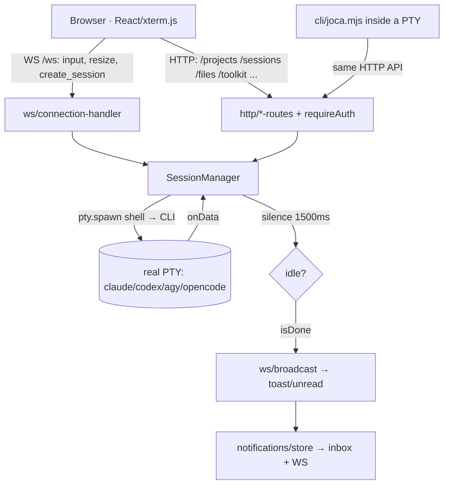

# JOCA development architecture

> Reference for whoever — human or agent — is going to touch the system. Describes **how JOCA is built** and **how you develop in it**.
> State verified in the code on 2026-08-20 (base: 2026-07-28). In this revision the subsystems that no longer exist in the code left the document — project manager / global Joca / "A Sala", Tasks/Kanban, Automations, heartbeat and run history. Everything that was not confirmed in a file is marked *in development* or omitted.
> Companions: [`AUDIT-2026-07-26.md`](AUDIT-2026-07-26.md) (debt), `README.md` (features), `install.md` / `update.md` (lifecycle).

---

## 1. The 10,000-foot view

JOCA is **two subsystems with opposite natures**, in the same repository:

```
                 ┌──────────────────────────────────────────────┐
                 │  JOCA_Brain — DECLARATIVE (markdown + JSON)  │
                 │  Does not run. Read by an agentic CLI.       │
                 │  skills · agents · commands · rules · hooks  │
                 │  memory/ (soul, INDEX, SKILL_INDEX, brain)   │
                 └───────────────────┬──────────────────────────┘
                                     │ read by
                     ┌───────────────┴────────────────┐
                     │  claude / codex / agy / opencode│  (external process)
                     └───────────────┬────────────────┘
                                     │ runs inside a PTY
                 ┌───────────────────┴──────────────────────────┐
                 │  JOCA_OS — EXECUTABLE (TypeScript)           │
                 │  Node+Express+ws+node-pty · React+Vite+xterm │
                 │  State as JSON in JOCA_OS/data/             │
                 └──────────────────────────────────────────────┘
```

**Why they are separate.** The Brain is *behavior*: versioned, shared between machines, synced from GitHub (`/update-joca`), and valid in any project — the CLI reads it wherever it runs. The OS is *local infrastructure*: processes, ports, PTYs, personal state files that are **never** committed. Mixing them would make it impossible to distribute the Brain without distributing the user's state, and impossible to update the OS without trampling customization.

**Source of truth, by domain:**

| Domain | Source of truth | Derived (never edit by hand) |
|---|---|---|
| Agent behavior | `JOCA_Brain/.claude/` + `memory/soul.md` + `memory/INDEX.md` (Claude-first, `CLAUDE.md:9-11`) | `AGENTS.md`, `GEMINI.md`, `.agents/`, `.codex/` — generated by `compile-bridges.sh` |
| Skill activation index | `.claude/skills/*.md` (frontmatter) | `memory/SKILL_INDEX.json` — generated by `build-skill-index.py` |
| Runtime state (projects, groups, session memory, settings, inbox) | `JOCA_OS/data/*.json` | — (gitignored) |
| Institutional memory (decisions/learnings) | `memory/decisions/*.jsonl`, `memory/learnings/*.jsonl` (append-only) | `.active.json` snapshot + FTS5 index in `memory/.index/` |

**Link between the two:** the backend discovers the Brain in `toolkit-registry.findJocaLogicRoot()` — `JOCA_LOGIC_PATH` (env) → sibling `../JOCA_Brain` → walking up directories looking for `CLAUDE.md`+`.claude`. Zero configuration in the normal case.

---

## 2. The JOCA_OS execution model

### 2.1 The full cycle



**Nothing starts on its own.** There is no clock and no queue: a terminal is born when the user clicks a
project's "+", or when an already-live agent asks for one through the bridge (`cli/joca.mjs`). What the
system does by itself is watch the PTY, decide that the burst has ended (§2.3) and notify.

**A terminal, step by step** (`session-manager.ts`):

1. `sessionManager.spawn({ resumePath: folder })` starts the shell and writes the CLI's launch line (`buildLaunchLine`).
2. The startup choreography waits for silence and answers the "trust this folder?" prompt if it appears. **No `/resume` is injected** — the project context is requested by the chat bar's button, which composes the `resumeCmd` of the CLI profile (`/resume` in Claude Code, `resume "<folder>"` in the others).
3. A message submitted programmatically (`POST /sessions/:id/input`, `submit` != `false`) goes through **bracketed paste** (`\x1b[200~…\x1b[201~` + a delayed CR) — without this, a multi-line body makes the TUI submit only the first line.
4. The PTY's `onData` feeds back into the SessionManager, which arms the `idleTimer`; after 1500 ms of silence it decides whether there was substantial work and emits `done`/notification.
5. The notification is written to the inbox **before** the WS broadcast — a closed tab loses nothing.

### 2.2 Invariants (do not break)

| Invariant | Where it lives |
|---|---|
| **No terminal is born on its own.** There is no clock and no queue in the backend (zero `setInterval`): a PTY only exists because the user opened it, or because an agent asked for it through the HTTP bridge. | `session-manager.ts` — only `spawn()` creates sessions |
| **The terminal stays open** after the burst ends — the user can read it or take over the keyboard. There is never a black box. | the end of a burst never calls `kill()` |
| **Cap of 30 simultaneous sessions** (`MAX_SESSIONS`), checked in the WS and in the creation route. | `session-manager.ts:95`, `sessions-routes.ts:79`, `ws/connection-handler.ts:45` |
| **Atomic writes** in every store: `writeFileAtomic` writes `.tmp` and does a `rename` — a kill mid-flight never corrupts the file. | `project-store.ts:82-87` |
| **Persist-then-broadcast**: the notification is written to the inbox *before* going to the WS; a closed tab loses nothing. | `notifications/store.ts:44-58` |
| **A single `session_created` broadcast**, emitted by the SessionManager's `spawn` event — sessions opened by an agent show up in the UI exactly like the ones created by the user. | `server.ts:24-29` |
| **Never expose without auth**: `JOCA_HOST` outside loopback aborts startup if there is no password. | `server.ts:111-119` |
| **Project boundary enforced in the backend** (`X-Joca-Session` header), not in the CLI: an agent of one project does not touch another project's sessions. | `sessions-routes.ts` — `crossProjectDenial()` |

### 2.3 Detecting "it is done" — the central heuristic

There is no completion API: JOCA infers it from the **PTY's silence**.

```
onData(chunk) → status=working, lastOutputTime=now, (re)arms idleTimer(1500ms)
   ↓ 1500ms with no output
idleTimer fires:
   substantial   = worked > 2000ms (DONE_MIN_WORK_MS)
   isDone        = notifyOnIdle  && substantial   → toast/unread in the UI
   dispatchDone  = awaitingDone  && substantial   → 'done' event (wakes whoever waits)
```

Two distinct flags, deliberately: `notifyOnIdle` is armed by **any** input with content (including the user typing); `awaitingDone` is armed **only** on a programmatic dispatch (`submitMessage` / initial brief). This is what stops the user typing in the terminal from waking whoever was waiting for something else.

### 2.4 Known fragile points (architectural, not one-off bugs)

- **Silence-based detection is probabilistic.** A CLI that pauses for >1.5 s mid-work is read as idle. Current mitigation: `DONE_MIN_WORK_MS`. Since there is no longer a queue consuming the `done`, the cost of a false positive today is one notification too many, not a misclassified task.
- **Text interaction with a TUI.** There is no protocol: you write ANSI and read the screen. Hence the bracketed-paste, the delayed CR, the `waitForQuiet` instead of fixed timers, and the parsing of the "trust" prompt. Any UI change in the upstream CLI can break startup.
- **A bare Enter does not count as an answer** (`session-manager.ts:604`, `data.trim().length > 0`): answering a menu with Enter alone does not arm `notifyOnIdle`, so that burst generates no notification.
- **`pty.write` in timer callbacks with no guard**: if the session dies between the scheduling and the firing, the exception is uncaught.

---

## 3. Data layer

Everything in `JOCA_OS/data/` (`DATA_DIR = __dirname/../../data`). **Gitignored at two levels** (the `.gitignore` of the root and of `JOCA_OS`) — it is per-machine personal state. Never commit it; if you work on more than one machine, sync it outside git (whichever method you prefer).

| File | Writes | Reads | Notes |
|---|---|---|---|
| `projects.json` | `projects-routes` | routes (they resolve the project's folder), UI | `Project {id,name,path,color,githubRepo,archived,order}` |
| `project-memory.json` | `SessionManager.spawn`, `projects-routes` | UI (recent sessions, favorites, panel) | cap of 12 recent sessions per project |
| `ui-settings.json` | `projects-routes` | `SessionManager` (`skipPermissions` → autonomous flags), UI (theme) | `skipPermissions`, theme/mode, `defaultCli`, brand theme |
| `project-groups.json` | `project-groups-store` | `project-groups-routes`, UI (sidebar) | grouping of projects in the sidebar |
| `notifications.json` | `notifications/store` | UI (inbox) | cap on the most recent ones (`MAX_NOTIFICATIONS`) |
| `auth.json` | `auth.setPassword` | `authEnabled()`, `verifyPassword` | scrypt(password, salt, 64); absent = auth off |
| `auth-tokens.json` | `auth.issueToken` | `isAuthenticated` | cap of 50 tokens, TTL 30 days |
| `cli-profiles.json` | (manual/UI) | `cli-profiles.loadCliProfiles` | *partial override* of the defaults by `id` — an upstream flag change is config, not code |

Write rules: `readJsonFile` returns the fallback on any error (**swallows corruption** — see debt); `writeJsonFile` → `writeFileAtomic` (tmp + rename). `DATA_DIR` is overridable by `JOCA_DATA_DIR` — that is what stops `npm test` from writing over the user's real data.

---

## 4. Mental model of the JOCA_Brain

### 4.1 The five layers

| Layer | Folder | Loading | Rule |
|---|---|---|---|
| **soul** | `memory/soul.md` | `@import` in `CLAUDE.md` — **the whole session** | personality + calibratable parameters (`autonomy_level`, `loop_max_iterations`…) |
| **rules** | `.claude/rules/*.md` | **auto-loaded in the whole session** | global directives only; see the cost warning in `rules/README.md`. Extensive detail goes to `.claude/reference/` (on-demand) |
| **skills** | `.claude/skills/*.md` — **flat, depth 1** | on-demand via `Read()` | activation by relevance ≥ 60%; notify `[skill: <name>]` |
| **agents** | `.claude/agents/*.md` | `Agent(subagent_type=…)` | isolated context, ~15x cost; **1 level only** |
| **commands** | `.claude/commands/*.md` | `/<name>` | human entry point; this (or the main loop) is where orchestration lives |

Beyond these: `hooks/` (Node, cross-platform, wired in `.claude/settings.json`) and `scripts/` (utilities: `joca-doctor`, `build-skill-index.py`, `compile-bridges.sh`, `joca-brain.mjs`, `joca-graph.mjs`).

### 4.2 How a skill is activated

```
prompt → [task-intake: classify route A/B/C/D]   ← rules/task-intake.md (+ UserPromptSubmit hook)
       → match ≥60% against SKILL_INDEX.json / Trigger Map of CLAUDE.md
       → Read(".claude/skills/<name>.md")  ← only here does the skill enter context
       → execute · notify [skill: <name>]
       → chain: → next step (reversible: fires by itself; irreversible: 1 line of gate)
```

`SKILL_INDEX.json` is the **light index** (name/path/description/triggers) — never all the skills in context. It is generated by `build-skill-index.py` from the frontmatter. *Real state today:* the generator only reads the `triggers:` field, truncates the description at 200 chars and writes `category: "general"` for all of them — which is why a good part of the inventory is invisible to automatic matching (audit B1/B2). Whoever depends on this (`task-router`, `/goal`) falls into the heuristic fallback.

### 4.3 The 1-level rule (the most important one)

> An agent dispatched via `Agent()` **cannot** dispatch another agent. The tree has 1 level: main loop → workers. There are no grandchildren. (`rules/orchestration-patterns.md`)

Consequences that constrain any new design:
- Orchestration lives **in the main loop or in a command** (`/goal`, `/one-shot`). `master-orchestrator.md` is a **playbook adopted by the main loop**, not a `subagent_type` you invoke.
- A router (`task-router`) **classifies and stops**; whoever executes is the caller.
- Parallel fan-out = all the `Agent()` calls **in the same turn**, cap 3-5 workers.
- Workers write results to disk (`.joca/intermediate/`) and return a summary + path — they do not flood the supervisor's context.

### 4.4 Chaining and pipelines

`chain:` in the frontmatter (list of next steps) + a `## Next step (chain)` section in the body (condition + gate). The **auto-runner** (`rules/pipelines.md`) runs a named pipeline end to end: each step in depth, auto-decides the reversible intermediate ones, gate only on the irreversible, brake at `loop_max_iterations` (default 4) and "3× with no progress → stop".

### 4.5 Event-sourced memory

`joca-brain.mjs` implements the institutional memory: **append-only** JSONL in `memory/decisions/` and `memory/learnings/`, with the "active" set **computed** (a decision not referenced by `supersede`/`redact`), repo/branch scope, secret-scan on write, and an `.active.json` snapshot for O(active) recall. Search tries **FTS5** via `node:sqlite` (Node ≥ 22.5, bm25 ranking, index rebuilt lazily by mtime, includes checkpoints) and falls back to substring when unavailable. `stop-checkpoint.js` creates automatic checkpoints (10 min throttle, keeps the 4 most recent auto ones). These folders are gitignored — memory is local.

---

## 5. How to develop in JOCA

### 5.1 Where to touch, by type of change

| Change | Files | Validate with |
|---|---|---|
| **New skill** | `.claude/skills/<name>.md` (flat, frontmatter `name`+`description`+`triggers`/`chain`) + an entry in `memory/INDEX.md` | `python .claude/scripts/validate-skill.py` (runs by itself in the `skill-lint` hook) + `python .claude/scripts/build-skill-index.py` |
| **New agent** | `.claude/agents/<name>.md`; **Step 0 in the body** with the `Read()` of the skills (the frontmatter's `skills:` field loads nothing) | invoke via `Agent(subagent_type=…)` in a real session |
| **New command** | `.claude/commands/<name>.md` + a row in the table of `CLAUDE.md` and of `memory/INDEX.md` | run `/<name>` |
| **New backend route** | `backend/src/http/<area>-routes.ts` (mount it in `server.ts` **behind `requireAuth`**) + an entry in the `proxy` of `frontend/vite.config.ts` (otherwise it only works in production) | `cd backend && npm run build && npm test` |
| **New store/state** | `backend/src/<area>/store.ts` in the existing pattern: `DATA_DIR`, `readJsonFile`/`writeJsonFile`, injectable broadcaster, injectable runner | `npm test` |
| **New frontend view** | `frontend/src/components/<X>.tsx` + `MainView` in `types.ts` + a branch in `App.tsx` (**there is no router** — navigation is `useState`) | `cd frontend && npm run build` |
| **New hook** | `.claude/hooks/<x>.js` (Node, no deps) + an entry in `.claude/settings.json` with an absolute path | `node .claude/scripts/joca-doctor.mjs` |

### 5.2 Validation commands

```bash
cd JOCA_OS/backend && npm test        # vitest: pure units (chunkText, cli-profiles, folderPickerCommand, PATH_SAFE) + route contracts, notifications, sessions, host
cd JOCA_OS/backend && npm run build   # tsc — the real type gate of the backend
cd JOCA_OS/frontend && npm run build  # tsc && vite build — produces the dist/ the backend serves
node JOCA_Brain/.claude/scripts/joca-doctor.mjs [--fix]   # system diagnostic (exit 1 if there is a ✗)
python JOCA_Brain/.claude/scripts/build-skill-index.py    # regenerate SKILL_INDEX.json
bash  JOCA_Brain/.claude/scripts/compile-bridges.sh       # regenerate AGENTS.md/GEMINI.md/.agents/.codex
```

Startup: `bash JOCA_OS/start.sh` (backend **7491**, Vite **7492**). In production the backend serves `frontend/dist` directly with an SPA fallback — which is why **compiling the frontend is not optional** in VPS/PWA mode.

### 5.3 Conventions observed in the repo

1. **A header comment that explains the WHY.** Every backend module opens with a block describing responsibility, invariants and pitfalls (see `session-manager.ts:1-16`, `agent-bridge.ts:1-11`, `providers/provider.ts:1-8`). A new module without that block sticks out.
2. **Dependencies injected, not imported the other way round.** Stores expose `setXBroadcaster()` / `setXRunner()`; `server.ts` wires them. It keeps the stores testable and with no Express/WS inside them.
3. **Atomic writes always** (`writeFileAtomic`): tmp + rename, never `fs.writeFileSync` directly onto the final file.
4. **Named constants at the top** of the module (`MAX_SESSIONS`, `DONE_MIN_WORK_MS`, `MAX_NOTIFICATIONS`) — never inline magic numbers.
5. **Language:** English throughout — UI, error messages, comments and log messages. New doctrine is written in English. Portuguese survives in four places, all deliberate: where it is the subject matter (the `pt-pt-translator` skill, Portuguese tax and legal terms in `portugal-*`), where a literal value is read by a program (JSON keys in `.joca/loop.json`, CLI flags, the `office-gifs` filenames), and in existing code identifiers, which were left alone because renaming them is a refactor, not a translation. The fourth is a single illustrative example where the Portuguese IS the point — `reference/frontend/anti-slop-bans.md`'s adblock-safe naming pair, which only demonstrates anything because the evading word is not English.
6. **Security through a single helper:** any path coming from outside goes through `safePath()`/`safePathForRead()` (`security-fs.ts`); any value that reaches a shell line goes through an allowlist regex (`PATH_SAFE`, `MODEL_SAFE`).
7. **Surgical:** touch only what is needed, do not "improve" adjacent code (`CLAUDE.md` §Code, `soul.md`).

---

## 6. Recommended development loop (dogfooding)

JOCA is developed with JOCA itself. Intended cycle:

```
   ┌──────────────────────────────────────────────────────────────┐
   │                                                              │
   ▼                                                              │
[TEST]  use JOCA in real work ────────────────────────────────┐   │
   │                                                          │   │
   ▼                                                          ▼   │
[CAPTURE]  /save at session end → feedback auto-extracted    /feedback-joca (explicit gap)
   │                                                          │   │
   ▼                                                          │   │
[DEVELOPMENT]  terminal open in the project, brief by hand   ◄──┘   │
   │                                                              │
   ▼                                                              │
[IMPROVEMENT]  /upgrade-joca [--auto]  → skill-improver/evaluator │
   │                                                              │
   ▼                                                              │
[VALIDATION]  npm test · builds · joca-doctor ────────────────────┘
   │
   ▼
[PERIODIC AUDIT]  docs/AUDIT-*.md → phased plan
```

How to use the system itself:

- **Development work in the project's terminal.** Open the terminal in the connected project, ask for the context with the resume button and give the brief. The terminal stays open — inspection and intervention always possible, and nothing runs without the user having ordered it.
- **`/upgrade-joca --auto`** is the headless mode designed exactly for a weekly automation. Conservative perimeter, verified in the command: it can apply `IMPROVE_SKILL`, `FIX_TRIGGER` and regenerate indexes/bridges; it **never** applies `NEW_SKILL`/`NEW_AGENT` on its own (those stay as a proposal), nor does it touch `CLAUDE.md`/`soul.md`/`rules/`/`settings.json`/hooks. Max. 5 improvements per run; with no pending feedback it finishes without inventing work.
- **Periodic audit** as an architecture gate: independent auditors in read-only, findings with `file:line`, and a phased plan. It is what produces the debt document of the next section.

Practical rule of the cycle: **a finding is only closed when there is automatic validation that would catch it again** (a vitest test, a `joca-doctor` check, or an entry in the skill index).

---

## 7. Technical debt and known risks

Full detail (with `file:line` and a 5-phase plan) in [`AUDIT-2026-07-26.md`](AUDIT-2026-07-26.md). Here we keep only what **constrains architecture decisions**:

1. **The wiring layer is the weak point, not the doctrine.** The audit's verdict: *the system knows what it should do; frequently it cannot reach the files that say so* — paths that do not resolve (`rules/` vs `.claude/rules/`), indexes that truncate, inert hooks with the `<JOCA_ROOT>` placeholder still unsubstituted. **Implication:** any new feature that depends on a path or an index needs a check in `joca-doctor`, or it is born silently dead.
2. **The trust boundary cannot be "it is local, therefore it is safe".** `requireSafeHost` already validates the `Host` against an allowlist before everything else (reads included), closing the DNS rebinding the audit flagged. The implication stands: any new path that calls the SDK from untrusted content has to pass `noTools`.
3. **Update/install path — partially resolved.** ✅ The hardcoded `origin/master` has already been fixed (`/update-joca` and `update.md` resolve the default branch and the frontend is now compiled). ✅ The `/install` ports were corrected to **7491/7492** (they were 7371/7372), and the skills/commands that still sent the user to the old ones were aligned. ✅ And `/update-joca` gained a **Phase 0** that distinguishes a clone of the public repo from an installation with a history of its own (private origin, public one as `upstream`): with no common ancestor it does not attempt a pull, it tells you to do a selective checkout and lists what has to be restored next. **Implication:** do not design features that depend on "the user has the latest version".
4. **The cap of 30 sessions is a global resource.** The automatic producer that exhausted it (the `worker` node of the automations) left along with the subsystem, but the lesson stands: any new producer of sessions — UI, agent bridge, whatever comes — needs a reuse/close policy, otherwise it backs the system up against the cap again.
5. **Skill index blind to ~43% of the inventory** (it only reads `triggers:`, truncates at 10 triggers and 200 chars, category always `general`). **Implication:** automatic ≥60% matching is today less reliable than the doctrine assumes; until it is fixed, the Trigger Map of `CLAUDE.md` is the safety net.
6. **The frontend does not survive a 401 nor a reconnect.** The fetches do not check `r.ok` before `r.json()`, and the output emitted during a disconnection is not re-synced into xterm — the normal case on a phone. (The reconnect backoff **already exists** today in `useSessionSocket.ts`; the central `fetchJson` is still to be done.) **Implication:** remote/PWA mode is not yet trustworthy for long work.
7. **Fixed context cost of ~11.4k tokens per session** (CLAUDE.md + soul + 8 rules + intake), with ~5k identified as reducible. **Implication:** adding a file to `.claude/rules/` is a recurring cost decision — the mandatory question is "does this have to be in context ALWAYS?".

*In development / not operational:* agents marked FUTUROS (`personal-comms`, `tech-debt-auditor`) show up in the Trigger Map as if they were ready; `JOCA_OS/DESIGN.md` is a living redesign document, not the implemented state.

---

## 8. Architectural decisions and rejected alternatives

| Decision | Why | Rejected alternative |
|---|---|---|
| **JSON/JSONL files instead of a database** | Single-user, local-first, small volumes; the state is readable and editable by hand, and debuggable without tools. Atomicity solved with tmp+rename; concurrency solved with append-only where it exists. | SQLite/Postgres — it would bring migrations, a daemon and one more native dependency for zero gain at the real scale. (`joca-brain.mjs` uses SQLite **only** as a disposable FTS5 index, never as a source of truth.) |
| **A real PTY instead of a headless SDK for the agentic work** | The user sees what the agent does and can take over the keyboard mid-flight; it is the same CLI they use in the terminal, with the same skills and the same subscription. No black box. | Headless SDK for everything — easier to instrument, but you lose the inspection and the possibility of intervening. The SDK is still available in `providers/provider.ts` for pure-text calls (`noTools`), but today **no caller uses it**: the subsystems that called it left. |
| **Zero cost through the subscription** | `providers/provider.ts` removes `ANTHROPIC_API_KEY`/`ANTHROPIC_AUTH_TOKEN` from the subprocess env (the SDK's `env` option **replaces**, it does not merge) so the CLI falls back to subscription authentication. | Billing per API key — it would change the system's cost model without the user noticing. |
| **Local-first, remote opt-in with mandatory auth** | Default bind on `127.0.0.1`; `JOCA_HOST` outside loopback **aborts startup** without a password. The OpenClaw lesson (30k+ exposed instances) is encoded as a hard rule, not as a warning. | Expose by default with a warning in the documentation. |
| **Multi-CLI through data profiles** | `cli-profiles.ts` describes each CLI (binary, model flag, autonomous flags, whether it runs the `/resume` choreography) and accepts a partial override in `data/cli-profiles.json`. An upstream flag rename is a config fix, not a deploy. | `if (cli === 'codex')` scattered through the code. |
| **Declarative Brain separate from the OS** | It allows distributing behavior without distributing state, and using the same Brain outside JOCA_OS (any terminal). | Packaging the skills inside the app — it would tie the behavior to the UI. |
| **Compiled bridges, `.claude/` canonical** | One source of truth; `AGENTS.md`/`GEMINI.md` are artifacts. | Maintaining three formats by hand (they diverge, and they already have — see the audit). |

**What you must NOT do** (negative rules, each with a cost already paid):

- ❌ Expose JOCA_OS beyond loopback without auth — and, even with auth, without TLS on the reverse proxy or a private network.
- ❌ Write agents that spawn agents. The tree has 1 level; an agent returns a *suggestion*, the caller executes.
- ❌ Add files to `.claude/rules/` for content that does not have to be in context in **every** session → it goes to `.claude/reference/` (on-demand).
- ❌ Create skills outside flat `.claude/skills/` (subfolders are not indexed) or without `triggers`/an actionable description.
- ❌ Commit `JOCA_OS/data/` (or `.claude/settings.local.json`, `memory/decisions|learnings|checkpoints`).
- ❌ Run SDK calls with tools active from untrusted content (web, external files) — `noTools: true` is the correct default for anything that is not a visible worker.
- ❌ Write JSON directly with `fs.writeFileSync` in a store — use `writeJsonFile`/`writeFileAtomic`.
- ❌ Open PTY sessions without a reuse or close policy — the cap of 30 is global.
- ❌ Make anything be born on its own in a terminal. Only (a) what the owner types and (b) what an agent explicitly asks for through the bridge get in. Automatic proactivity has already been tried and it left.
