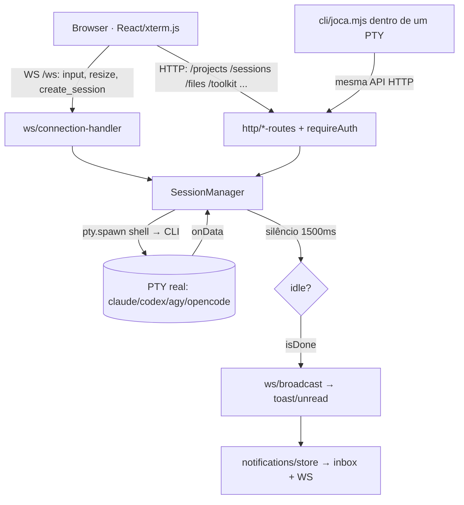

# Arquitectura de desenvolvimento do JOCA

> Referência para quem — humano ou agente — vai mexer no sistema. Descreve **como o JOCA está construído** e **como se desenvolve nele**.
> Estado verificado no código a 2026-08-20 (base: 2026-07-28). Nesta revisão saíram do documento os subsistemas que já não existem no código — gestor de projecto / Joca global / "A Sala", Tarefas/Kanban, Automações, heartbeat e histórico de execuções. Tudo o que não foi confirmado em ficheiro está marcado como *em desenvolvimento* ou omitido.
> Complementos: [`AUDITORIA-2026-07-26.md`](AUDITORIA-2026-07-26.md) (dívida), `README.md` (features), `install.md` / `update.md` (ciclo de vida).

---

## 1. Visão de 10.000 pés

O JOCA são **dois subsistemas com naturezas opostas**, no mesmo repositório:

```
                 ┌──────────────────────────────────────────────┐
                 │  JOCA_Brain — DECLARATIVO (markdown + JSON)  │
                 │  Não corre. É lido por um CLI agentico.      │
                 │  skills · agents · commands · rules · hooks  │
                 │  memory/ (soul, INDEX, SKILL_INDEX, brain)   │
                 └───────────────────┬──────────────────────────┘
                                     │ lido por
                     ┌───────────────┴────────────────┐
                     │  claude / codex / agy / opencode│  (processo externo)
                     └───────────────┬────────────────┘
                                     │ corre dentro de um PTY
                 ┌───────────────────┴──────────────────────────┐
                 │  JOCA_OS — EXECUTÁVEL (TypeScript)           │
                 │  Node+Express+ws+node-pty · React+Vite+xterm │
                 │  Estado em JSON em JOCA_OS/data/            │
                 └──────────────────────────────────────────────┘
```

**Porque estão separados.** O Brain é *comportamento*: versionado, partilhado entre máquinas, sincronizado do GitHub (`/update-joca`), e válido em qualquer projecto — o CLI lê-o onde quer que corra. O OS é *infra-estrutura local*: processos, portas, PTYs, ficheiros de estado pessoais que **nunca** são commitados. Misturá-los tornaria impossível distribuir o Brain sem distribuir o estado do utilizador, e impossível actualizar o OS sem pisar personalização.

**Fonte de verdade, por domínio:**

| Domínio | Fonte de verdade | Derivado (nunca editar à mão) |
|---|---|---|
| Comportamento do agente | `JOCA_Brain/.claude/` + `memory/soul.md` + `memory/INDEX.md` (Claude-first, `CLAUDE.md:9-11`) | `AGENTS.md`, `GEMINI.md`, `.agents/`, `.codex/` — gerados por `compile-bridges.sh` |
| Índice de activação de skills | `.claude/skills/*.md` (frontmatter) | `memory/SKILL_INDEX.json` — gerado por `build-skill-index.py` |
| Estado runtime (projectos, grupos, memória de sessões, definições, inbox) | `JOCA_OS/data/*.json` | — (gitignored) |
| Memória institucional (decisões/aprendizagens) | `memory/decisions/*.jsonl`, `memory/learnings/*.jsonl` (append-only) | `.active.json` snapshot + índice FTS5 em `memory/.index/` |

**Ligação entre os dois:** o backend descobre o Brain em `toolkit-registry.findJocaLogicRoot()` — `JOCA_LOGIC_PATH` (env) → irmão `../JOCA_Brain` → subida de directórios à procura de `CLAUDE.md`+`.claude`. Zero configuração no caso normal.

---

## 2. Modelo de execução do JOCA_OS

### 2.1 O ciclo completo



**Nada arranca sozinho.** Não há relógio nem fila: um terminal nasce quando o utilizador carrega no
"+" de um projecto, ou quando um agente já vivo o pede pela ponte (`cli/joca.mjs`). O que o sistema
faz por si é observar o PTY, decidir que a rajada acabou (§2.3) e notificar.

**Passo a passo de um terminal** (`session-manager.ts`):

1. `sessionManager.spawn({ resumePath: pasta })` arranca a shell e escreve a linha de lançamento do CLI (`buildLaunchLine`).
2. A coreografia de arranque espera silêncio e responde ao prompt "trust this folder?" se aparecer. **Nenhum `/resume` é injectado** — o contexto do projecto é pedido pelo botão da barra do chat, que compõe o `resumeCmd` do perfil do CLI (`/resume` no Claude Code, `resume "<pasta>"` nos outros).
3. Uma mensagem submetida programaticamente (`POST /sessions/:id/input`, `submit` != `false`) vai por **bracketed paste** (`\x1b[200~…\x1b[201~` + um CR atrasado) — sem isto, um corpo multi-linha faz o TUI submeter só a primeira linha.
4. O `onData` do PTY realimenta o SessionManager, que arma o `idleTimer`; ao fim de 1500 ms de silêncio decide se houve trabalho substancial e emite `done`/notificação.
5. A notificação é gravada na inbox **antes** do broadcast WS — uma tab fechada não perde nada.

### 2.2 Invariantes (não quebrar)

| Invariante | Onde vive |
|---|---|
| **Nenhum terminal nasce sozinho.** Não há relógio nem fila no backend (zero `setInterval`): um PTY só existe porque o utilizador o abriu, ou porque um agente o pediu pela ponte HTTP. | `session-manager.ts` — só `spawn()` cria sessões |
| **O terminal fica aberto** depois de a rajada acabar — o utilizador pode ler ou assumir o teclado. Nunca há caixa preta. | o fim de uma rajada nunca chama `kill()` |
| **Cap de 30 sessões** simultâneas (`MAX_SESSIONS`), verificado no WS e na rota de criação. | `session-manager.ts:95`, `sessions-routes.ts:79`, `ws/connection-handler.ts:45` |
| **Escrita atómica** em todos os stores: `writeFileAtomic` escreve `.tmp` e faz `rename` — um kill a meio nunca corrompe o ficheiro. | `project-store.ts:82-87` |
| **Persist-then-broadcast**: a notificação é gravada na inbox *antes* de ir para o WS; uma tab fechada não perde nada. | `notifications/store.ts:44-58` |
| **Um único broadcast de `session_created`**, emitido pelo evento `spawn` do SessionManager — sessões abertas por um agente aparecem na UI exactamente como as criadas pelo utilizador. | `server.ts:24-29` |
| **Nunca expor sem auth**: `JOCA_HOST` fora de loopback aborta o arranque se não houver password. | `server.ts:111-119` |
| **Fronteira de projecto imposta no backend** (header `X-Joca-Session`), não no CLI: um agente de um projecto não toca nas sessões de outro. | `sessions-routes.ts` — `crossProjectDenial()` |

### 2.3 Detecção de "acabou" — a heurística central

Não há API de conclusão: o JOCA infere-a do **silêncio do PTY**.

```
onData(chunk) → status=working, lastOutputTime=now, (re)arma idleTimer(1500ms)
   ↓ 1500ms sem output
idleTimer dispara:
   substantial   = trabalhou > 2000ms (DONE_MIN_WORK_MS)
   isDone        = notifyOnIdle  && substantial   → toast/unread na UI
   dispatchDone  = awaitingDone  && substantial   → evento 'done' (acorda quem espera)
```

Duas flags distintas, de propósito: `notifyOnIdle` arma-se com **qualquer** input com conteúdo (incluindo o utilizador a escrever); `awaitingDone` arma-se **só** em dispatch programático (`submitMessage` / brief inicial). É isto que impede que o utilizador a escrever no terminal acorde quem esperava por outra coisa.

### 2.4 Pontos frágeis conhecidos (arquitecturais, não bugs pontuais)

- **Detecção por silêncio é probabilística.** Um CLI que faça uma pausa de >1,5 s a meio do trabalho é lido como idle. Mitigação actual: `DONE_MIN_WORK_MS`. Como já não há fila a consumir o `done`, o custo de um falso positivo é hoje uma notificação a mais, não uma tarefa mal classificada.
- **Interacção por texto com um TUI.** Não há protocolo: escreve-se ANSI e lê-se o ecrã. Daí o bracketed-paste, o CR atrasado, o `waitForQuiet` em vez de timers fixos, e o parsing do prompt de "trust". Qualquer mudança de UI do CLI upstream pode partir o arranque.
- **Enter puro não conta como resposta** (`session-manager.ts:604`, `data.trim().length > 0`): responder a um menu só com Enter não arma `notifyOnIdle`, portanto essa rajada não gera notificação.
- **`pty.write` em callbacks de timer sem guarda**: se a sessão morrer entre o agendamento e o disparo, a excepção é não-capturada.

---

## 3. Camada de dados

Tudo em `JOCA_OS/data/` (`DATA_DIR = __dirname/../../data`). **Gitignorado em dois níveis** (`.gitignore` da raiz e do `JOCA_OS`) — é estado pessoal por máquina. Nunca commitar; se trabalhares em mais do que uma máquina, sincroniza-o por fora do git (o teu método preferido).

| Ficheiro | Escreve | Lê | Notas |
|---|---|---|---|
| `projects.json` | `projects-routes` | routes (resolvem a pasta do projecto), UI | `Project {id,name,path,color,githubRepo,archived,order}` |
| `project-memory.json` | `SessionManager.spawn`, `projects-routes` | UI (sessões recentes, favoritos, painel) | cap 12 sessões recentes por projecto |
| `ui-settings.json` | `projects-routes` | `SessionManager` (`skipPermissions` → flags autónomas), UI (tema) | `skipPermissions`, tema/modo, `defaultCli`, tema de marca |
| `project-groups.json` | `project-groups-store` | `project-groups-routes`, UI (barra lateral) | agrupamento de projectos na barra lateral |
| `notifications.json` | `notifications/store` | UI (inbox) | cap nos mais recentes (`MAX_NOTIFICATIONS`) |
| `auth.json` | `auth.setPassword` | `authEnabled()`, `verifyPassword` | scrypt(password, salt, 64); ausência = auth desligada |
| `auth-tokens.json` | `auth.issueToken` | `isAuthenticated` | cap 50 tokens, TTL 30 dias |
| `cli-profiles.json` | (manual/UI) | `cli-profiles.loadCliProfiles` | *override parcial* dos defaults por `id` — mudança de flag upstream é config, não código |

Regras de escrita: `readJsonFile` devolve o fallback em qualquer erro (**engole corrupção** — ver dívida); `writeJsonFile` → `writeFileAtomic` (tmp + rename). `DATA_DIR` é sobreponível por `JOCA_DATA_DIR` — é o que impede o `npm test` de escrever por cima dos dados reais do utilizador.

---

## 4. Modelo mental do JOCA_Brain

### 4.1 As cinco camadas

| Camada | Pasta | Carregamento | Regra |
|---|---|---|---|
| **soul** | `memory/soul.md` | `@import` no `CLAUDE.md` — **toda a sessão** | personalidade + parâmetros calibráveis (`autonomy_level`, `loop_max_iterations`…) |
| **rules** | `.claude/rules/*.md` | **auto-carregado em toda a sessão** | só directivas globais; ver o aviso de custo em `rules/README.md`. Detalhe extenso vai para `.claude/reference/` (on-demand) |
| **skills** | `.claude/skills/*.md` — **flat, profundidade 1** | on-demand via `Read()` | activação por relevância ≥ 60%; notificar `[skill: <nome>]` |
| **agents** | `.claude/agents/*.md` | `Agent(subagent_type=…)` | contexto isolado, custo ~15x; **1 nível apenas** |
| **commands** | `.claude/commands/*.md` | `/<nome>` | entrada humana; é aqui (ou no main loop) que vive a orquestração |

Além destas: `hooks/` (Node, cross-platform, ligados em `.claude/settings.json`) e `scripts/` (utilitários: `joca-doctor`, `build-skill-index.py`, `compile-bridges.sh`, `joca-brain.mjs`, `joca-graph.mjs`).

### 4.2 Como uma skill é activada

```
prompt → [task-intake: classificar via A/B/C/D]  ← rules/task-intake.md (+ hook UserPromptSubmit)
       → match ≥60% contra SKILL_INDEX.json / Trigger Map do CLAUDE.md
       → Read(".claude/skills/<nome>.md")  ← só aqui a skill entra em contexto
       → executar · notificar [skill: <nome>]
       → chain: → passo seguinte (reversível: dispara sozinho; irreversível: 1 linha de gate)
```

O `SKILL_INDEX.json` é o **índice leve** (nome/path/description/triggers) — nunca as skills todas em contexto. É gerado por `build-skill-index.py` a partir do frontmatter. *Estado real hoje:* o gerador só lê o campo `triggers:`, trunca a description a 200 chars e escreve `category: "general"` para todas — por isso boa parte do inventário é invisível ao matching automático (auditoria B1/B2). Quem depende disto (`task-router`, `/goal`) cai no fallback heurístico.

### 4.3 A regra de 1 nível (a mais importante)

> Um agente despachado via `Agent()` **não pode** despachar outro agente. A árvore tem 1 nível: main loop → workers. Não há netos. (`rules/orchestration-patterns.md`)

Consequências que condicionam qualquer desenho novo:
- Orquestração vive **no main loop ou num command** (`/goal`, `/one-shot`). `master-orchestrator.md` é um **playbook adoptado pelo main loop**, não um `subagent_type` que se invoca.
- Um router (`task-router`) **classifica e pára**; quem executa é o caller.
- Fan-out paralelo = todas as chamadas `Agent()` **no mesmo turno**, cap 3-5 workers.
- Workers escrevem resultados para disco (`.joca/intermediate/`) e devolvem resumo + path — não inundam o contexto do supervisor.

### 4.4 Chaining e pipelines

`chain:` no frontmatter (lista de próximos passos) + secção `## Próximo passo (chain)` no corpo (condição + gate). O **auto-runner** (`rules/pipelines.md`) corre uma pipeline nomeada de ponta a ponta: cada passo a fundo, auto-decide as intermédias reversíveis, gate só no irreversível, travão em `loop_max_iterations` (default 4) e "3× sem progresso → parar".

### 4.5 Memória event-sourced

`joca-brain.mjs` implementa a memória institucional: JSONL **append-only** em `memory/decisions/` e `memory/learnings/`, com o conjunto "activo" **computado** (uma decisão não referida por `supersede`/`redact`), scope repo/branch, secret-scan na escrita, e snapshot `.active.json` para recall O(activos). A pesquisa tenta **FTS5** via `node:sqlite` (Node ≥ 22.5, ranking bm25, índice reconstruído lazy por mtime, inclui checkpoints) e cai para substring quando indisponível. `stop-checkpoint.js` cria checkpoints automáticos (throttle 10 min, mantém os 4 auto mais recentes). Estas pastas são gitignored — memória é local.

---

## 5. Como desenvolver no JOCA

### 5.1 Onde tocar, por tipo de mudança

| Mudança | Ficheiros | Validar com |
|---|---|---|
| **Nova skill** | `.claude/skills/<nome>.md` (flat, frontmatter `name`+`description`+`triggers`/`chain`) + entrada em `memory/INDEX.md` | `python .claude/scripts/validate-skill.py` (corre sozinho no hook `skill-lint`) + `python .claude/scripts/build-skill-index.py` |
| **Novo agente** | `.claude/agents/<nome>.md`; **Step 0 no corpo** com o `Read()` das skills (o campo `skills:` do frontmatter não carrega nada) | invocar via `Agent(subagent_type=…)` numa sessão real |
| **Novo comando** | `.claude/commands/<nome>.md` + linha na tabela do `CLAUDE.md` e do `memory/INDEX.md` | correr `/<nome>` |
| **Nova rota backend** | `backend/src/http/<área>-routes.ts` (montar em `server.ts` **atrás de `requireAuth`**) + entrada no `proxy` do `frontend/vite.config.ts` (senão só funciona em produção) | `cd backend && npm run build && npm test` |
| **Novo store/estado** | `backend/src/<área>/store.ts` no padrão existente: `DATA_DIR`, `readJsonFile`/`writeJsonFile`, broadcaster injectável, runner injectável | `npm test` |
| **Nova vista frontend** | `frontend/src/components/<X>.tsx` + `MainView` em `types.ts` + branch em `App.tsx` (**não há router** — a navegação é `useState`) | `cd frontend && npm run build` |
| **Novo hook** | `.claude/hooks/<x>.js` (Node, sem deps) + entrada em `.claude/settings.json` com path absoluto | `node .claude/scripts/joca-doctor.mjs` |

### 5.2 Comandos de validação

```bash
cd JOCA_OS/backend && npm test        # vitest: unidades puras (chunkText, cli-profiles, folderPickerCommand, PATH_SAFE) + contratos de rotas, notificações, sessões, host
cd JOCA_OS/backend && npm run build   # tsc — o gate real de tipos do backend
cd JOCA_OS/frontend && npm run build  # tsc && vite build — produz o dist/ que o backend serve
node JOCA_Brain/.claude/scripts/joca-doctor.mjs [--fix]   # diagnóstico do sistema (exit 1 se houver ✗)
python JOCA_Brain/.claude/scripts/build-skill-index.py    # regenerar SKILL_INDEX.json
bash  JOCA_Brain/.claude/scripts/compile-bridges.sh       # regenerar AGENTS.md/GEMINI.md/.agents/.codex
```

Arranque: `bash JOCA_OS/start.sh` (backend **7491**, Vite **7492**). Em produção o backend serve `frontend/dist` directamente com fallback SPA — por isso **compilar o frontend não é opcional** em modo VPS/PWA.

### 5.3 Convenções observadas no repo

1. **Comentário de cabeçalho que explica o PORQUÊ.** Todos os módulos do backend abrem com um bloco que descreve responsabilidade, invariantes e armadilhas (ver `session-manager.ts:1-16`, `agent-bridge.ts:1-11`, `providers/provider.ts:1-8`). Um módulo novo sem esse bloco destoa.
2. **Dependências injectadas, não importadas ao contrário.** Stores expõem `setXBroadcaster()` / `setXRunner()`; o `server.ts` liga-os. Mantém os stores testáveis e sem Express/WS lá dentro.
3. **Escrita atómica sempre** (`writeFileAtomic`): tmp + rename, nunca `fs.writeFileSync` directo sobre o ficheiro final.
4. **Constantes nomeadas no topo** do módulo (`MAX_SESSIONS`, `DONE_MIN_WORK_MS`, `MAX_NOTIFICATIONS`) — nunca números mágicos inline.
5. **Idioma:** pt-PT em tudo o que o utilizador lê (mensagens de erro, UI); inglês nos comentários técnicos, nomes de símbolos e mensagens de log. As rules e commands do Brain são bilingues por herança — a doutrina nova escreve-se em pt-PT.
6. **Segurança por helper único:** qualquer path vindo do exterior passa por `safePath()`/`safePathForRead()` (`security-fs.ts`); qualquer valor que chegue a uma linha de shell passa por regex de allowlist (`PATH_SAFE`, `MODEL_SAFE`).
7. **Cirúrgico:** tocar só no necessário, não "melhorar" código adjacente (`CLAUDE.md` §Code, `soul.md`).

---

## 6. Loop de desenvolvimento recomendado (dogfooding)

O JOCA desenvolve-se com o próprio JOCA. Ciclo pretendido:

```
   ┌──────────────────────────────────────────────────────────────┐
   │                                                              │
   ▼                                                              │
[TESTE]  usar o JOCA em trabalho real ────────────────────────┐   │
   │                                                          │   │
   ▼                                                          ▼   │
[CAPTURA]  /save no fim da sessão → feedback auto-extraído   /feedback-joca (gap explícito)
   │                                                          │   │
   ▼                                                          │   │
[DESENVOLVIMENTO]  terminal aberto no projecto, brief à mão  ◄──┘   │
   │                                                              │
   ▼                                                              │
[MELHORIA]  /upgrade-joca [--auto]  → skill-improver/evaluator    │
   │                                                              │
   ▼                                                              │
[VALIDAÇÃO]  npm test · builds · joca-doctor ─────────────────────┘
   │
   ▼
[AUDITORIA periódica]  docs/AUDITORIA-*.md → plano por fases
```

Como usar o próprio sistema:

- **Trabalho de desenvolvimento no terminal do projecto.** Abrir o terminal no projecto ligado, pedir o contexto pelo botão de resume e dar o brief. O terminal fica aberto — inspecção e intervenção sempre possíveis, e nada corre sem o utilizador ter mandado.
- **`/upgrade-joca --auto`** é o modo headless pensado exactamente para uma automação semanal. Perímetro conservador, verificado no comando: pode aplicar `IMPROVE_SKILL`, `FIX_TRIGGER` e regenerar índices/bridges; **nunca** aplica sozinho `NEW_SKILL`/`NEW_AGENT` (ficam como proposta), nem toca em `CLAUDE.md`/`soul.md`/`rules/`/`settings.json`/hooks. Máx. 5 melhorias por run; sem feedback pendente termina sem inventar trabalho.
- **Auditoria periódica** como gate de arquitectura: auditores independentes em só-leitura, achados com `ficheiro:linha`, e um plano por fases. É o que produz o documento de dívida da secção seguinte.

Regra prática do ciclo: **um achado só está fechado quando existe validação automática que o apanharia outra vez** (teste vitest, check do `joca-doctor`, ou entrada no índice de skills).

---

## 7. Dívida técnica e riscos conhecidos

Detalhe completo (com `ficheiro:linha` e plano em 5 fases) em [`AUDITORIA-2026-07-26.md`](AUDITORIA-2026-07-26.md). Aqui fica só o que **condiciona decisões de arquitectura**:

1. **A camada de ligação é o ponto fraco, não a doutrina.** O veredicto da auditoria: *o sistema sabe o que devia fazer; frequentemente não consegue chegar aos ficheiros que o dizem* — paths que não resolvem (`rules/` vs `.claude/rules/`), índices que truncam, hooks inertes com o placeholder `<JOCA_ROOT>` por substituir. **Implicação:** qualquer feature nova que dependa de um path ou índice precisa de um check no `joca-doctor`, ou nasce silenciosamente morta.
2. **A fronteira de confiança não pode ser "é local, logo é seguro".** O `requireSafeHost` já valida o `Host` contra allowlist antes de tudo o resto (leituras incluídas), fechando o DNS rebinding que a auditoria assinalou. Fica de pé a implicação: qualquer caminho novo que chame o SDK a partir de conteúdo não confiável tem de passar `noTools`.
3. **Caminho de actualização/instalação — parcialmente resolvido.** ✅ O `origin/master` fixo já foi corrigido (`/update-joca` e `update.md` resolvem o ramo por defeito e o frontend passou a ser compilado). ✅ As portas do `/install` foram corrigidas para **7491/7492** (eram 7371/7372), e as skills/comandos que ainda mandavam o utilizador para as antigas foram alinhados. ✅ E o `/update-joca` ganhou uma **Fase 0** que distingue um clone do público de uma instalação com história própria (origin privado, público como `upstream`): sem ancestral comum não tenta pull, manda fazer checkout selectivo e lista o que há a repor a seguir. **Implicação:** não desenhar features que dependam de "o utilizador tem a última versão".
4. **O cap de 30 sessões é um recurso global.** O produtor automático que o esgotava (o nó `worker` das automações) saiu com o subsistema, mas a lição fica: qualquer produtor novo de sessões — UI, ponte de agentes, o que vier — precisa de política de reutilização/fecho, senão volta a encostar o sistema ao cap.
5. **Índice de skills cego a ~43% do inventário** (só lê `triggers:`, trunca a 10 triggers e 200 chars, categoria sempre `general`). **Implicação:** o matching automático ≥60% é hoje menos fiável do que a doutrina assume; até estar corrigido, o Trigger Map do `CLAUDE.md` é a rede de segurança.
6. **Frontend não sobrevive a um 401 nem a uma reconnect.** Os fetches não verificam `r.ok` antes de `r.json()`, e o output emitido durante uma desconexão não é re-sincronizado no xterm — o caso normal em telemóvel. (O backoff de reconnect **já existe** hoje em `useSessionSocket.ts`; o `fetchJson` central continua por fazer.) **Implicação:** o modo remoto/PWA ainda não é de confiança para trabalho longo.
7. **Custo fixo de contexto ~11,4k tokens por sessão** (CLAUDE.md + soul + 8 rules + intake), com ~5k identificados como redutíveis. **Implicação:** adicionar um ficheiro a `.claude/rules/` é uma decisão de custo recorrente — a pergunta obrigatória é "isto tem de estar em contexto SEMPRE?".

*Em desenvolvimento / não operacional:* agentes marcados FUTUROS (`personal-comms`, `tech-debt-auditor`) aparecem no Trigger Map como se estivessem prontos; `JOCA_OS/DESIGN.md` é documento vivo de redesign, não o estado implementado.

---

## 8. Decisões arquitecturais e alternativas rejeitadas

| Decisão | Porquê | Alternativa rejeitada |
|---|---|---|
| **Ficheiros JSON/JSONL em vez de base de dados** | Single-user, local-first, volumes pequenos; o estado é legível e editável à mão, e é debugável sem ferramentas. Atomicidade resolvida com tmp+rename; concorrência resolvida com append-only onde existe. | SQLite/Postgres — traria migrações, um daemon e uma dependência nativa a mais para zero ganho na escala real. (O `joca-brain.mjs` usa SQLite **só** como índice FTS5 descartável, nunca como fonte de verdade.) |
| **PTY real em vez de SDK headless para o trabalho agentico** | O utilizador vê o que o agente faz e pode assumir o teclado a meio; é o mesmo CLI que ele usa no terminal, com as mesmas skills e a mesma subscrição. Sem caixa preta. | SDK headless para tudo — mais fácil de instrumentar, mas perde-se a inspecção e a possibilidade de intervir. O SDK continua disponível em `providers/provider.ts` para chamadas de texto puro (`noTools`), mas hoje **nenhum caller o usa**: os subsistemas que o chamavam saíram. |
| **Custo-zero por subscrição** | `providers/provider.ts` remove `ANTHROPIC_API_KEY`/`ANTHROPIC_AUTH_TOKEN` do env do subprocesso (a opção `env` do SDK **substitui**, não faz merge) para o CLI cair na autenticação por subscrição. | Faturar por API key — mudaria o modelo de custo do sistema sem o utilizador perceber. |
| **Local-first, remoto opt-in com auth obrigatória** | Bind default em `127.0.0.1`; `JOCA_HOST` fora de loopback **aborta o arranque** sem password. A lição OpenClaw (30k+ instâncias expostas) está codificada como regra dura, não como aviso. | Expor por default com aviso na documentação. |
| **Multi-CLI por perfis de dados** | `cli-profiles.ts` descreve cada CLI (binário, flag de modelo, flags autónomas, se corre a coreografia `/resume`) e aceita override parcial em `data/cli-profiles.json`. Um rename de flag upstream é uma correcção de config, não um deploy. | `if (cli === 'codex')` espalhado pelo código. |
| **Brain declarativo separado do OS** | Permite distribuir comportamento sem distribuir estado, e usar o mesmo Brain fora do JOCA_OS (qualquer terminal). | Empacotar as skills dentro da app — prenderia o comportamento à UI. |
| **Bridges compilados, `.claude/` canónico** | Uma fonte de verdade; `AGENTS.md`/`GEMINI.md` são artefactos. | Manter três formatos à mão (divergem, e já divergiram — ver auditoria). |

**O que NÃO se deve fazer** (regras negativas, cada uma com um custo já pago):

- ❌ Expor o JOCA_OS para lá de loopback sem auth — e, mesmo com auth, sem TLS no reverse proxy ou rede privada.
- ❌ Escrever agentes que fazem spawn de agentes. A árvore tem 1 nível; um agente devolve *sugestão*, o caller executa.
- ❌ Adicionar ficheiros a `.claude/rules/` para conteúdo que não tem de estar em contexto em **todas** as sessões → vai para `.claude/reference/` (on-demand).
- ❌ Criar skills fora de `.claude/skills/` flat (subpastas não são indexadas) nem sem `triggers`/description accionável.
- ❌ Commitar `JOCA_OS/data/` (ou `.claude/settings.local.json`, `memory/decisions|learnings|checkpoints`).
- ❌ Correr chamadas ao SDK com ferramentas activas a partir de conteúdo não confiável (web, ficheiros externos) — `noTools: true` é o default correcto para tudo o que não seja um worker visível.
- ❌ Escrever JSON directamente com `fs.writeFileSync` num store — usar `writeJsonFile`/`writeFileAtomic`.
- ❌ Abrir sessões PTY sem política de reutilização ou fecho — o cap de 30 é global.
- ❌ Fazer alguma coisa nascer sozinha num terminal. Só entram (a) o que o dono escreve e (b) o que um agente pede explicitamente pela ponte. Proactividade automática já foi tentada e saiu.
